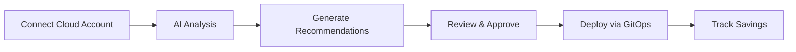

# JetScale Documentation

> **AI-powered cloud cost optimization that delivers actionable recommendations with infrastructure-as-code.**

Welcome to the JetScale documentation. Whether you're setting up your first cloud connection or diving deep into our API, you'll find everything you need here.

---

## 🚀 Getting Started

New to JetScale? Start here:

**[AWS Setup →](aws-setup.md)**
Connect your AWS account securely using IAM roles

**[Azure Setup →](azure-setup.md)**
Connect Azure with service principal authentication

**[Quick Start Guide →](getting-started.md)**
Get up and running in minutes

---

## 💡 What is JetScale?

JetScale uses specialized AI agents to continuously analyze your cloud infrastructure, identify cost optimization opportunities, and generate production-ready infrastructure-as-code changes—all integrated into your existing workflows.

### The JetScale Difference

- ✅ **AI agents** trained on each cloud service type (RDS, EC2, EBS, ElastiCache)
- ✅ **Real data analysis** from CloudWatch, Cost Explorer, and Azure Monitor
- ✅ **Automated validation** ensures recommendations maintain performance and SLAs
- ✅ **GitOps-native** with GitHub, Jira, and Bitbucket integration
- ✅ **Production-ready** Terraform code generation

---

## 🛠️ Supported Cloud Services

### AWS Services

| Service | Coverage | Optimization Focus |
|---------|----------|-------------------|
| **RDS** | Standalone instances, Aurora clusters | Right-sizing, instance class selection, topology optimization |
| **EC2** | All instance types and families | Instance type recommendations, utilization analysis |
| **EBS** | gp2, gp3, io1, io2, magnetic | Volume type optimization, IOPS provisioning, size right-sizing |
| **ElastiCache** | Redis, Memcached | Node type optimization, cluster configuration |

### Azure Services

| Service | Coverage | Optimization Focus |
|---------|----------|-------------------|
| **Virtual Machines** | All VM series | VM size recommendations, reservation opportunities |
| **SQL Database** | Azure SQL, MySQL, PostgreSQL | Tier and compute optimization |
| **Storage** | Blob, Files, Managed Disks | Storage tier optimization, capacity planning |

> **Coming Soon:** Support for S3, Lambda, DynamoDB, and Azure Cosmos DB

---

## 🔄 How It Works

1. **Connect Your Cloud Account**
   Secure, read-only access via IAM role (AWS) or service principal (Azure)

2. **AI Analysis**
   Multi-agent system analyzes utilization metrics, pricing, and usage patterns

3. **Generate Recommendations**
   AI creates optimized configurations with:
   - Cost impact analysis
   - Performance validation
   - Terraform/IaC code

4. **Review & Deploy**
   Integrate with GitHub, Jira, or Bitbucket for approval workflows

5. **Track Savings**
   Monitor implemented optimizations and realized cost reductions

---

## 📚 Documentation

### Core Concepts
- [Architecture Overview](architecture.md) - System design and AI agent workflows
- [AI Agents](ai-agents.md) - How specialized agents work
- [Recommendation Workflow](recommendation-workflow.md) - From analysis to deployment

### Service Guides
- [RDS Optimization](services/rds.md)
- [EC2 Optimization](services/ec2.md)
- [EBS Optimization](services/ebs.md)
- [ElastiCache Optimization](services/elasticache.md)

### Integration
- [GitHub Integration](integrations/github.md)
- [Jira Integration](integrations/jira.md)
- [Bitbucket Integration](integrations/bitbucket.md)

### Reference
- [API Reference](api-reference.md)
- [Deployment Guide](deployment.md)
- [Configuration](configuration.md)

---

## 🤝 Support & Community

**Need Help?**
- 📧 Email: [support@jetscale.ai](mailto:support@jetscale.ai)
- 💬 [GitHub Discussions](https://github.com/Jetscale-ai/jetscale-docs/discussions)
- 🐛 [Report an Issue](https://github.com/Jetscale-ai/jetscale-docs/issues)

**Resources:**
- [GitHub Organization](https://github.com/Jetscale-ai)
- [Change Log](https://github.com/Jetscale-ai/jetscale-docs/releases)

---

**Ready to optimize your cloud costs?**
[Get Started →](getting-started.md) | [Schedule a Demo](mailto:support@jetscale.ai?subject=Demo%20Request)

