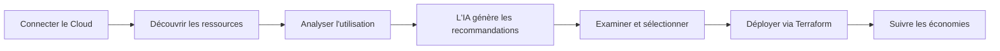

# Comment fonctionne JetScale

> Transformez les coûts cloud en économies grâce à l'optimisation par IA

## Aperçu

JetScale découvre automatiquement les opportunités d'économies dans votre infrastructure cloud et les livre sous forme de code Terraform prêt pour la production. Ce guide explique le workflow de la plateforme JetScale - ce qui se passe lorsque vous connectez votre compte cloud et comment vous obtenez des économies concrètes.

---

## Le processus JetScale



### Workflow en 3 étapes

1. **Connecter** → Accorder un accès cloud en lecture seule
2. **Examiner** → Parcourir les recommandations générées par l'IA avec estimations d'économies
3. **Déployer** → Obtenir le code Terraform via pull request, fusionner et économiser

---

## 1. Connecter votre compte cloud

**Ce que vous faites :**
- Accorder à JetScale un accès en lecture seule à votre environnement AWS ou Azure
- Aucune permission d'écriture - JetScale ne modifie jamais directement votre infrastructure
- Prend 5 minutes avec nos guides étape par étape

**Comment fonctionne la sécurité :**
- **AWS** : Rôle IAM inter-comptes avec vérification External ID
- **Azure** : Service Principal avec authentification par certificat
- **Aucune information d'identification stockée** : Tout utilise des jetons temporaires et à portée limitée
- **Permissions en lecture seule** : JetScale ne peut que consulter les métadonnées de ressources et les métriques

**Ce dont JetScale a besoin :**
- AWS : ARN du rôle IAM et External ID
- Azure : Tenant ID, Subscription ID, identifiants du Service Principal

[Guide de configuration AWS](aws-setup.md) | [Guide de configuration Azure](azure-setup.md)

---

## 2. Découvrir les ressources

**Ce que JetScale trouve :**

**Ressources de calcul :**
- Instances EC2 (tous types et familles)
- Machines virtuelles Azure
- Groupes Auto Scaling
- Lacunes de couverture Reserved Instance

**Bases de données :**
- Instances RDS (tous moteurs : MySQL, PostgreSQL, SQL Server)
- Clusters Aurora
- Bases de données Azure SQL
- Réplicas en lecture et configurations multi-AZ

**Stockage :**
- Volumes EBS (tous types : gp2, gp3, io1, io2)
- Snapshots et sauvegardes
- Disques managés Azure

**Cache :**
- ElastiCache (Redis, Memcached)
- Azure Cache pour Redis

**Processus de découverte :**
- Analyse automatiquement toutes les régions de votre compte
- Catalogue les configurations de ressources et leurs relations
- Identifie les modèles de tags et la structure organisationnelle
- Mise à jour quotidienne pour détecter les nouvelles ressources et changements

---

## 3. Analyser les modèles d'utilisation

**Collecte de données historiques :**

JetScale récupère des données d'utilisation complètes depuis :
- Les métriques **AWS CloudWatch** ou **Azure Monitor**
- Les API **Cost Explorer** ou **Azure Cost Management**
- Les métriques de performance (CPU, mémoire, réseau, E/S disque)
- Les données de coût (dépenses actuelles, utilisation RI, Savings Plans)

**Métriques de performance suivies :**
- Utilisation CPU (moyenne, p50, p95, p99, max)
- Utilisation de la mémoire et pression
- Débit réseau et taux de paquets
- IOPS disque et débit
- Connexions de base de données et modèles de requêtes
- Taux de succès/échec du cache

**Reconnaissance de modèles :**

L'IA de JetScale classifie les charges de travail :

| Modèle | Caractéristiques | Stratégie d'optimisation |
|---------|-----------------|----------------------|
| **État stable** | Utilisation constante | Reserved Instances, dimensionnement approprié |
| **Par pics** | Moyenne faible, pics élevés | Instances burstables (T3/T4g) |
| **Planifié** | Modèles réguliers activé/désactivé | Automatisation de la planification |
| **Inactif** | Utilisation minimale | Arrêt ou réduction significative |
| **Sur-provisionné** | Capacité élevée, faible utilisation | Opportunités de dimensionnement approprié |

---

## 4. Recommandations générées par l'IA

**Ce qui rend JetScale différent :**

Contrairement aux outils de coût génériques qui vous alertent simplement d'une faible utilisation CPU, l'IA de JetScale comprend les nuances de chaque service cloud :

**Pour les bases de données :**
- Modèles de basculement multi-AZ et besoins en capacité
- Tolérances de latence des réplicas en lecture
- Comportement du pooling de connexions
- Caractéristiques de la charge de travail des requêtes

**Pour le calcul :**
- Modèles de solde de crédits des instances burstables
- Besoins en marge des Auto Scaling Groups
- Configurations de contrôle de santé des load balancers
- Compatibilité de migration Graviton

**Pour le stockage :**
- Modèles de bursts IOPS vs débit soutenu
- Caractéristiques de performance des types de volumes
- Optimisation du cycle de vie des snapshots

**Types de recommandations :**

| Type | Ce que vous obtenez | Exemple d'économies |
|------|--------------|-----------------|
| **Dimensionnement approprié** | Ajuster la capacité à l'utilisation réelle | 30-50% par ressource |
| **Reserved Instances** | Acheter des engagements pour charges prévisibles | 40-60% vs on-demand |
| **Migration Graviton** | Passer aux instances AWS Graviton basées sur ARM | 30-40% même performance |
| **Optimisation du stockage** | Mettre à niveau les types de volumes ou ajuster les IOPS | 20-30% (ex. gp2→gp3) |
| **Planification** | Arrêter/démarrer les ressources hors heures | 65-75% pour hors production |
| **Nettoyage** | Supprimer les ressources inutilisées | 100% pour ressources zombies |

**Chaque recommandation inclut :**
- **Estimation d'économies mensuelles** : Détail des coûts
- **Évaluation de l'impact sur les performances** : Zéro temps d'arrêt ou ajustements mineurs notés
- **Niveau de risque d'implémentation** : Faible, Moyen ou Élevé avec risques spécifiques
- **Comparaison avant/après** : Vue côte à côte de la configuration
- **Preuves à l'appui** : Graphiques et métriques historiques
- **Instructions de retour arrière** : Chemin facile de retour si nécessaire

**Validation de sécurité :**

Avant de recommander tout changement, JetScale valide :
- **Minimum 20% de marge CPU** au-dessus du pic historique
- **Minimum 15% de marge mémoire** au-dessus du pic d'utilisation
- **Exigences de haute disponibilité** préservées (multi-AZ, réplicas)
- **SLA de performance** maintenus
- **Capacité suffisante** pour les pics de trafic et la croissance

---

## 5. Examiner et sélectionner les recommandations

**Vue du tableau de bord :**

Les recommandations sont organisées par :
- **Économies potentielles** (de la plus élevée à la plus basse)
- **Niveau de risque** (prioriser les gains rapides à faible risque)
- **Type de ressource** (EC2, RDS, EBS, etc.)
- **Compte cloud** (si gestion de plusieurs comptes)

**Détails des recommandations :**

Cliquez sur n'importe quelle recommandation pour voir :
- **Résumé** : Ce qui change et pourquoi
- **Preuves** : Graphiques d'utilisation historiques
- **Comparaison de configuration** : Paramètres actuels vs recommandés
- **Calcul des économies** : Analyse détaillée des coûts
- **Évaluation d'impact** : Considérations de performance et disponibilité
- **Notes d'implémentation** : Prérequis et considérations spéciales

**Sélection en masse :**
- Sélectionner plusieurs recommandations pour implémentation groupée
- Filtrer par critères (ex. "toutes les recommandations à faible risque > 100$/mois")
- Prévisualiser les économies combinées sur les sélections

---

## 6. Déployer les changements

**Terraform prêt pour la production :**

Lorsque vous approuvez des recommandations, JetScale génère :
- **Format HCL standard** : Fonctionne avec Terraform 0.13+
- **Blocs lifecycle** : Déploiements sécurisés avec create-before-destroy
- **Documentation** : Commentaires en ligne expliquant chaque changement
- **Instructions de retour arrière** : Récupération facile si nécessaire
- **Suivi des économies** : Tags pour rapports de ROI

**Exemple de code généré :**
```hcl
# Recommandation JetScale : REC-2025-001
# Économies mensuelles estimées : 248,16 $
# Risque d'implémentation : FAIBLE

resource "aws_instance" "web_server_01" {
  instance_type = "t3.large"  # Changé de t3.xlarge

  lifecycle {
    create_before_destroy = true
  }

  tags = {
    Name                      = "web-server-01"
    JetScaleRecommendation    = "REC-2025-001"
    JetScaleMonthlySavings    = "248.16"
    JetScalePreviousType      = "t3.xlarge"
  }
}
```

**Options d'intégration :**

**GitHub/Bitbucket :**
- Création automatique de pull request dans votre dépôt
- La PR inclut documentation complète, analyse de coûts et liste de vérification de tests
- Reviewers auto-assignés selon vos paramètres d'équipe
- Liens vers le tableau de bord JetScale pour preuves détaillées

**Jira :**
- Création automatique de ticket pour suivi
- Champs personnalisés pour économies et ROI
- Synchronisation du statut avec les pull requests
- Intégration de rapports exécutifs

**Téléchargement manuel :**
- Télécharger les fichiers Terraform en ZIP
- Appliquer via votre workflow Terraform existant
- Flexibilité complète pour processus personnalisés

[Guide d'intégration GitHub](integrations/github.md) | [Guide d'intégration Jira](integrations/jira.md)

---

## 7. Suivre les économies

**Surveillance continue :**

Après le déploiement, JetScale suit :
- **Économies réelles vs projetées** : Vérifier la précision des recommandations
- **Métriques de performance post-changement** : Assurer aucune dégradation
- **Tendances d'utilisation des ressources** : Repérer de nouvelles opportunités d'optimisation
- **Économies cumulées dans le temps** : Démontrer le ROI aux parties prenantes

**Rapports et analyses :**
- Tableau de bord d'économies mensuelles avec analyse de tendances
- Totaux année en cours et calculs de ROI
- Attribution des économies au niveau des ressources
- Export des données pour rapports exécutifs et FinOps

**Découverte continue :**
- **Analyses quotidiennes** pour nouvelles opportunités d'optimisation
- **Alertes** quand des recommandations à forte valeur sont disponibles
- **Analyse de tendances** pour identifier le gaspillage croissant
- **Détection de modèles saisonniers** pour optimisations planifiées

---

## Sécurité et confiance

### Ce que JetScale stocke

**Données que nous conservons :**
- Métadonnées de ressources (ID d'instances, types, configurations)
- Métriques d'utilisation agrégées (période de rétention configurable)
- Historique des recommandations et statut d'approbation
- Préférences utilisateur et paramètres d'équipe

**Données que nous ne stockons jamais :**
- Données applicatives ou logique métier
- Contenus de base de données ou données clients
- Code source ou propriété intellectuelle
- Identifiants IAM (seuls des jetons temporaires utilisés)

### Chiffrement et conformité

**Protection des données :**
- **Au repos** : Chiffrement AES-256
- **En transit** : TLS 1.3 pour toutes les connexions
- **Gestion des clés** : Clés de chiffrement séparées par client

**Certifications de conformité :**
- Certifié **SOC 2 Type II**
- Conforme **RGPD** (options de résidence des données disponibles)
- Conforme **CCPA**
- **Audits de sécurité réguliers** par des entreprises tierces

### Contrôle d'accès

**Permissions en lecture seule :**
- JetScale n'a besoin que d'un accès en lecture aux configurations de ressources et métriques
- Aucune permission d'écriture, suppression ou modification accordée
- Tous les changements sont examinés et déployés par vous
- Votre code reste dans vos dépôts

**Piste d'audit :**
- Tous les appels API enregistrés et disponibles pour examen
- Intégration CloudTrail/Azure Activity Log
- Journaux d'accès fournis sur demande pour revues de sécurité

---

## Pourquoi JetScale vous fait gagner du temps

**Sans JetScale :**
- Analyse manuelle CloudWatch/Azure Monitor : 8-12 heures/mois
- Recherche d'options de dimensionnement approprié : 4-6 heures/mois
- Écriture du code Terraform : 6-8 heures/mois
- Tests et validation : 4-6 heures/mois
- **Total** : 22-32 heures/mois par ingénieur

**Avec JetScale :**
- Examiner les recommandations : 30 minutes/mois
- Approuver et fusionner les PR : 30 minutes/mois
- Surveiller les résultats : 15 minutes/mois
- **Total** : 75 minutes/mois
- **Temps économisé** : 95%

---

## Prochaines étapes

**Démarrer :**
1. [Connecter un compte AWS](aws-setup.md) (5 minutes)
2. [Connecter un compte Azure](azure-setup.md) (5 minutes)
3. [Configurer les intégrations](integrations/README.md) (GitHub, Jira, Slack)

**En savoir plus :**
- [Analyse approfondie de l'IA](ai-analysis.md) - Comment notre IA valide la sécurité
- [Services supportés](services/README.md) - Ce que JetScale optimise
- [FAQ](faq.md) - Questions fréquentes répondues

**Besoin d'aide ?**
- Email : [support@jetscale.ai](mailto:support@jetscale.ai)
- Chat en direct dans le tableau de bord
- [Planifier une démo](https://jetscale.ai/demo)

---

*Dernière mise à jour : 29 janvier 2025*
