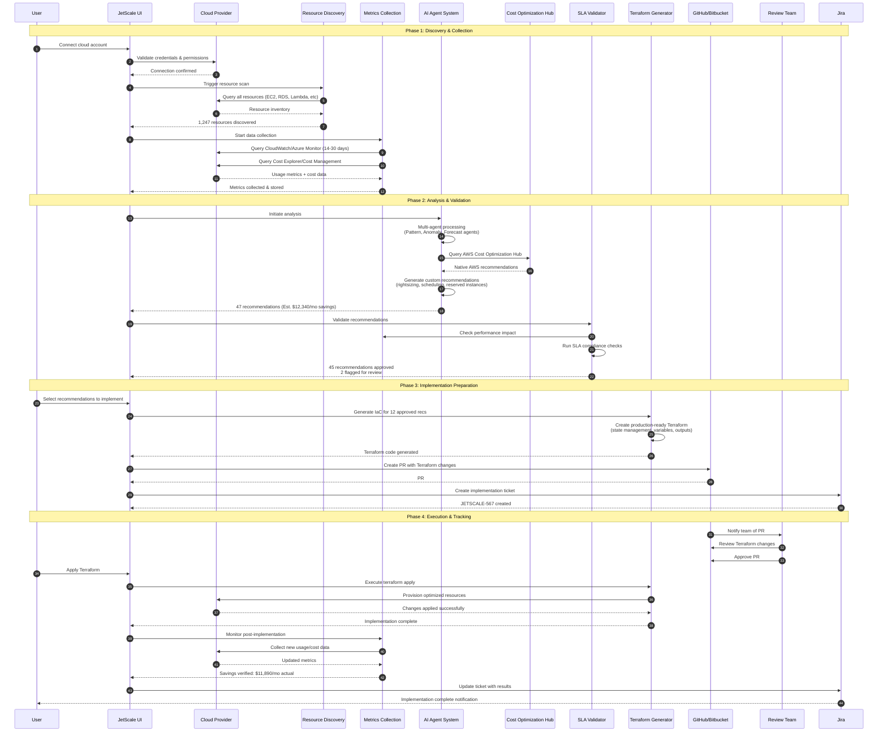
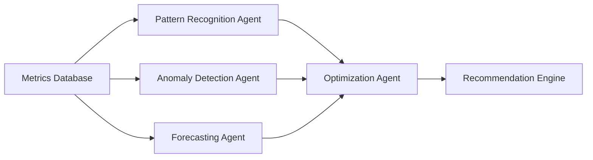
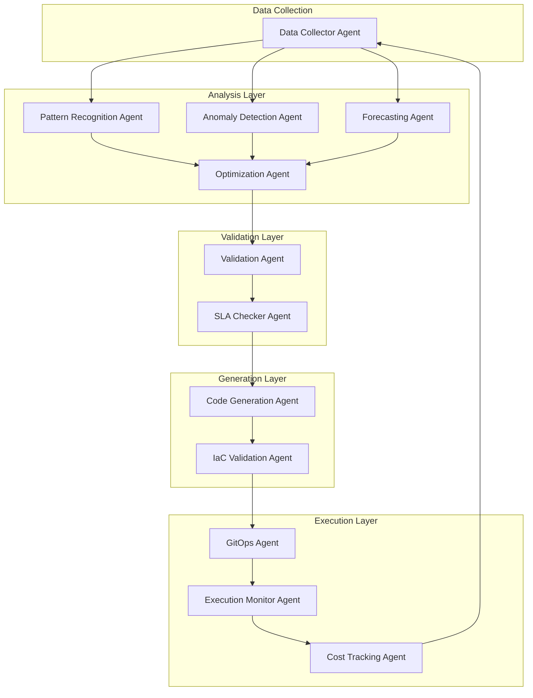

# Flux de Recommandations

> **Guide complet du processus d'optimisation des coûts de bout en bout de JetScale**

## Aperçu

Le flux de recommandations de JetScale est un système intelligent et automatisé qui identifie, valide et implémente en continu des optimisations de coûts cloud dans vos environnements AWS et Azure. En combinant une analyse IA multi-agents avec une Infrastructure as Code (IaC) prête pour la production, JetScale fournit des économies vérifiées tout en maintenant la performance et la conformité aux SLA.

### Capacités Clés

- **Découverte Automatisée** : Analyse continue des ressources cloud sur AWS et Azure
- **Analyse Alimentée par l'IA** : Système multi-agents qui traite les modèles d'utilisation et les données de coûts
- **Recommandations Validées** : Évaluation de l'impact sur la performance et les SLA avant l'implémentation
- **IaC Prêt pour la Production** : Génération automatisée de Terraform pour des déploiements sécurisés
- **Intégration GitOps** : Flux de travail basé sur les PR avec GitHub et Bitbucket
- **Suivi de Bout en Bout** : Intégration Jira pour une piste d'audit complète et vérification des économies

### Phases du Flux de Travail

Le flux de recommandations de JetScale se compose de quatre phases principales :

1. **Découverte et Collection** (Étapes 1-3) : Connexion des comptes, analyse des ressources, collecte des métriques
2. **Analyse et Validation** (Étapes 4-6) : Traitement IA, génération de recommandations, vérifications SLA
3. **Préparation de l'Implémentation** (Étapes 7-8) : Génération Terraform, création de PR GitOps
4. **Exécution et Suivi** (Étapes 9-11) : Révision, application des changements, vérification des économies

---

## Diagramme Complet du Flux de Travail



---

## Flux de Travail Étape par Étape

### Étape 1 : Connexion du Compte Cloud

**Objectif** : Établir une connexion sécurisée aux comptes AWS et/ou Azure

**Processus** :

1. Accéder à **Paramètres > Comptes Cloud**
2. Cliquer sur **Ajouter un Compte** et sélectionner le fournisseur (AWS ou Azure)
3. Suivre la configuration spécifique au fournisseur :
   - **AWS** : Créer un rôle IAM avec la politique de confiance JetScale, fournir l'ARN du rôle
   - **Azure** : Enregistrer l'application, accorder les rôles Lecteur d'Abonnement + Lecteur de Gestion des Coûts
4. JetScale valide les identifiants et les autorisations
5. Le compte apparaît dans le tableau de bord avec le statut "Connecté"

**Autorisations Requises** :

- **AWS** : ReadOnlyAccess, CostExplorerReadOnly, TrustedAdvisor:Describe*
- **Azure** : Reader, Cost Management Reader

**Délai** : 5-10 minutes

**Documentation Connexe** :
- [Guide de Configuration AWS](aws-setup.md)
- [Guide de Configuration Azure](azure-setup.md)

---

### Étape 2 : Découverte des Ressources

**Objectif** : Analyser et cataloguer toutes les ressources cloud dans les comptes

**Processus** :

1. L'analyse automatisée démarre immédiatement après la connexion du compte
2. JetScale interroge les API des fournisseurs cloud pour découvrir :
   - **Calcul** : EC2, VM Azure, Lambda, App Service
   - **Stockage** : EBS, S3, Stockage Azure, disques gérés
   - **Bases de Données** : RDS, DynamoDB, Cosmos DB, SQL Database
   - **Réseau** : Équilibreurs de charge, passerelles NAT, passerelles VPN
   - **Conteneurs** : ECS, EKS, AKS, instances de conteneurs
3. Les ressources sont étiquetées avec des métadonnées (région, type, environnement)
4. L'inventaire est stocké et indexé pour une interrogation rapide

**Portée de la Découverte** :

- Toutes les régions activées dans votre compte
- Tous les types de ressources supportés par JetScale (100+ AWS, 80+ Azure)
- Ressources dans tous les niveaux d'abonnement (niveau gratuit à entreprise)

**Délai** : 5-30 minutes (varie selon la taille du compte)

**Exemple de Résultat** :

```
✓ 1 247 ressources découvertes dans 3 comptes
  - 342 instances EC2
  - 89 bases de données RDS
  - 156 fonctions Lambda
  - 234 volumes EBS
  - 426 autres ressources
```

**Agents IA Impliqués** : Aucun (requêtes API directes)

---

### Étape 3 : Collection des Données

**Objectif** : Rassembler les métriques d'utilisation et les données de coûts pour l'analyse

**Processus** :

1. JetScale commence la collecte continue de métriques :
   - **CloudWatch/Azure Monitor** : CPU, mémoire, réseau, E/S disque
   - **Cost Explorer/Gestion des Coûts** : Ventilation quotidienne des coûts
   - **Métriques spécifiques aux services** : Invocations Lambda, connexions RDS, etc.
2. Données historiques collectées sur une période configurable
3. Métriques agrégées à plusieurs intervalles (5 min, 1 h, 1 jour)
4. Données normalisées et stockées dans une base de données de séries temporelles

**Métriques Collectées** :

| Type de Ressource | Métriques Clés |
|-------------------|----------------|
| EC2/VM | Utilisation CPU, mémoire, E/S réseau, E/S disque |
| RDS/SQL | Connexions, CPU, stockage, IOPS, latence lecture/écriture |
| Lambda | Invocations, durée, utilisation mémoire, erreurs |
| EBS/Disque | IOPS, débit, type de volume |
| S3/Stockage | Requêtes, transfert de données, utilisation des classes de stockage |

**Délai** : Continu (référence initiale : 24-48 heures)

**Rétention des Données** : 90 jours (configurable)

**Agents IA Impliqués** : Aucun (collecte de métriques directe)

---

### Étape 4 : Analyse IA

**Objectif** : Traiter les métriques avec un système IA multi-agents pour identifier les opportunités d'optimisation

**Processus** :

1. **Agent de Reconnaissance de Modèles** :
   - Analyse les tendances d'utilisation dans le temps
   - Identifie les ressources inactives/sous-utilisées
   - Détecte les modèles récurrents (ex. : arrêts le week-end)

2. **Agent de Détection d'Anomalies** :
   - Signale les pics ou baisses inhabituels d'utilisation
   - Identifie les ressources avec une performance erratique
   - Détecte les mauvaises configurations potentielles

3. **Agent de Prévision** :
   - Prédit l'utilisation future basée sur les données historiques
   - Modélise les variations saisonnières
   - Estime la trajectoire des coûts

4. **Agent d'Optimisation** :
   - Évalue les opportunités d'économies potentielles
   - Calcule les ratios risque/bénéfice
   - Priorise les recommandations par impact

**Interactions entre Agents** :



**Modèles IA Utilisés** :

- Analyse de séries temporelles (ARIMA, Prophet)
- Algorithmes de clustering (K-means, DBSCAN)
- Réseaux neuronaux pour la reconnaissance de modèles
- Détection statistique d'anomalies

**Délai** : 30-60 minutes pour l'analyse initiale, puis continu

**Résultat** : Insights structurés prêts pour la génération de recommandations

---

### Étape 5 : Génération de Recommandations

**Objectif** : Créer des recommandations d'optimisation des coûts actionnables et validées

**Processus** :

1. **Recommandations Natives** :
   - Interroger AWS Cost Optimization Hub (EC2, RDS, EBS, Lambda)
   - Récupérer les recommandations Azure Advisor
   - Analyser et normaliser les recommandations

2. **Recommandations Personnalisées** :
   - Générer des optimisations spécifiques à JetScale :
     - **Redimensionnement** : Changements de types d'instances basés sur l'utilisation
     - **Planification** : Modèles d'arrêt/démarrage pour les ressources dev/test
     - **Instances Réservées** : Recommandations d'engagement
     - **Optimisation du Stockage** : Politiques de cycle de vie S3, types de volumes EBS
     - **Migration Serverless** : Alternatives Lambda pour les applications à faible trafic

3. **Enrichissement des Recommandations** :
   - Ajouter des estimations d'économies de coûts
   - Calculer l'effort d'implémentation (faible/moyen/élevé)
   - Joindre les métriques et preuves pertinentes
   - Inclure les procédures de retour arrière

**Catégories de Recommandations** :

| Catégorie | Exemples | Économies Typiques |
|-----------|----------|-------------------|
| Redimensionnement | Réduire les instances sur-provisionnées | 30-50 % par ressource |
| Planification | Arrêter les ressources hors prod hors horaires | 60-75 % pour planifié |
| Engagement | Instances Réservées, Plans d'Économies | 30-70 % long terme |
| Stockage | Cycle de vie S3, changements de types EBS | 40-80 % sur stockage |
| Serverless | Migrer vers Lambda/Functions | 70-90 % pour faible trafic |
| Nettoyage | Supprimer les ressources inutilisées | 100 % par ressource |

**Délai** : 10-20 minutes

**Exemple de Résultat** :

```yaml
Recommendation ID: REC-2024-001
Type: Redimensionnement
Ressource: i-0abcd1234efgh5678 (prod-web-server-01)
Actuel: t3.xlarge (4 vCPU, 16GB RAM)
Recommandé: t3.large (2 vCPU, 8GB RAM)
Raison: CPU moyen 12%, Mémoire moyenne 28% sur période historique
Économies Mensuelles: $62.04 (réduction de 48%)
Effort: Faible
Risque: Faible
Preuves: [Métriques CloudWatch jointes]
```

**Agents IA Impliqués** : Agent d'Optimisation, Agent d'Analyse des Coûts

---

### Étape 6 : Validation

**Objectif** : Vérifier que les recommandations n'impacteront pas négativement la performance ou les SLA

**Processus** :

1. **Évaluation de l'Impact sur la Performance** :
   - Simuler les changements recommandés par rapport à la charge historique
   - Modéliser les scénarios d'utilisation maximale
   - Calculer le risque de dégradation de la performance
   - Vérifier par rapport aux seuils définis (ex. : CPU <80%)

2. **Vérification de Conformité SLA** :
   - Vérifier par rapport aux SLA définis par l'utilisateur :
     - Exigences de temps de réponse
     - Objectifs de disponibilité (99,9%, 99,99%)
     - Minimums de débit
   - Signaler les recommandations qui risquent de violer les SLA

3. **Analyse des Dépendances** :
   - Vérifier les dépendances entre ressources
   - Identifier les impacts en cascade (ex. : groupes de mise à l'échelle)
   - Valider les changements réseau/groupes de sécurité

4. **Notation de Sécurité** :
   - Attribuer un score de risque (1-10) à chaque recommandation
   - Risque faible (1-3) : Éligible à l'auto-approbation
   - Risque moyen (4-7) : Signaler pour révision
   - Risque élevé (8-10) : Nécessite une approbation explicite

**Règles de Validation** :

| Vérification | Seuil | Action en Cas d'Échec |
|--------------|-------|----------------------|
| Marge CPU | >20 % de capacité | Signaler pour révision |
| Marge mémoire | >15 % de capacité | Signaler pour révision |
| Gestion charge maximale | Doit gérer le 99e percentile | Bloquer la recommandation |
| Impact disponibilité | SLA maintenu | Bloquer la recommandation |
| Faisabilité retour arrière | Doit être réversible <5 min | Signaler pour révision |

**Délai** : 5-10 minutes par recommandation

**Résultat** :

```
✓ 45 recommandations validées et approuvées
⚠ 2 recommandations signalées pour révision manuelle :
  - REC-2024-018 : Peut impacter la charge maximale (réviser les métriques)
  - REC-2024-031 : Engagement Instance Réservée (vérifier la tendance d'utilisation)
✗ 0 recommandations bloquées
```

**Agents IA Impliqués** : Agent de Validation, Agent de Vérification SLA

---

### Étape 7 : Génération Terraform

**Objectif** : Créer une Infrastructure as Code prête pour la production pour les recommandations approuvées

**Processus** :

1. **Génération de Code** :
   - Convertir les recommandations en HCL Terraform
   - Générer des modules pour chaque type de ressource
   - Inclure des variables pour les valeurs spécifiques à l'environnement
   - Ajouter des sorties pour le suivi et la vérification

2. **Gestion de l'État** :
   - Configurer le backend d'état distant (S3/Stockage Azure)
   - Configurer le verrouillage d'état (DynamoDB/Stockage Azure)
   - Inclure la configuration de l'espace de travail pour multi-env

3. **Fonctionnalités de Sécurité** :
   - Ajouter des règles de cycle de vie `prevent_destroy` pour les ressources critiques
   - Inclure `create_before_destroy` pour les changements sans temps d'arrêt
   - Générer des fichiers de plan pour révision
   - Ajouter des instructions de retour arrière dans les commentaires

4. **Tests** :
   - Exécuter `terraform validate` sur le code généré
   - Exécuter `terraform plan` en mode simulation
   - Vérifier les erreurs de syntaxe et les avertissements

**Structure Terraform** :

```
jetscale-optimizations/
├── main.tf                 # Définitions de ressources primaires
├── variables.tf            # Variables d'entrée
├── outputs.tf              # Sorties pour le suivi
├── backend.tf              # Config backend d'état
├── versions.tf             # Versions de fournisseurs
├── modules/
│   ├── ec2-rightsizing/    # Modifications d'instances EC2
│   ├── rds-optimization/   # Changements RDS
│   ├── lambda-scheduling/  # Configuration Lambda
│   └── storage-lifecycle/  # Politiques S3/EBS
└── README.md               # Guide d'implémentation
```

**Exemple de Terraform Généré** :

```hcl
# main.tf
resource "aws_instance" "prod_web_server_01" {
  instance_type = "t3.large"  # Changé de t3.xlarge

  lifecycle {
    create_before_destroy = true
  }

  tags = {
    Name                  = "prod-web-server-01"
    JetScaleRecommendation = "REC-2024-001"
    JetScaleSavings       = "62.04"
  }
}

# outputs.tf
output "optimized_instances" {
  value = {
    "prod-web-server-01" = {
      old_type = "t3.xlarge"
      new_type = aws_instance.prod_web_server_01.instance_type
      monthly_savings = 62.04
    }
  }
}
```

**Délai** : 5-15 minutes par lot de recommandations

**Agents IA Impliqués** : Agent de Génération de Code, Agent de Validation IaC

---

### Étape 8 : Intégration GitOps

**Objectif** : Créer des pull requests dans le contrôle de version pour la révision de l'équipe

**Processus** :

1. **Configuration du Dépôt** (une fois) :
   - Connecter le compte GitHub ou Bitbucket
   - Sélectionner le dépôt cible
   - Configurer la stratégie de branches (ex. : `jetscale/optimizations/*`)

2. **Création de PR** :
   - Créer une branche de fonctionnalité depuis main/master
   - Committer le code Terraform avec un message descriptif
   - Générer la PR avec une description détaillée :
     - Résumé des recommandations
     - Économies et impact attendus
     - Résultats de validation
     - Procédures de retour arrière
   - Ajouter les réviseurs automatiquement (configurable)

3. **Métadonnées de PR** :
   - Lien vers le tableau de bord des recommandations JetScale
   - Joindre des graphiques d'analyse des coûts
   - Inclure les configurations de ressources avant/après
   - Ajouter un workflow CI/CD pour terraform plan

**Modèle de Description de PR** :

```markdown
## PR d'Optimisation des Coûts JetScale

### Résumé
Cette PR implémente 12 recommandations JetScale avec des économies estimées de **$2 847/mois**.

### Recommandations Incluses
- **6x Redimensionnement** : Réduire les instances EC2 sur-provisionnées
- **3x Planification** : Implémenter l'arrêt/démarrage pour les ressources dev
- **2x Stockage** : Optimiser les types de volumes EBS
- **1x Nettoyage** : Supprimer les snapshots inutilisés

### Statut de Validation
✓ Toutes les recommandations ont passé les vérifications de conformité SLA
✓ Impact sur la performance modélisé et acceptable
✓ Procédures de retour arrière documentées

### Impact Attendu
- **Économies Mensuelles** : $2 847
- **Économies Annuelles** : $34 164
- **Ressources Affectées** : 12
- **Niveau de Risque** : Faible

### Tests
- [x] `terraform validate` réussi
- [x] `terraform plan` révisé
- [ ] Révision par les pairs requise

### Plan de Retour Arrière
Si vous devez annuler un changement, vous pouvez revenir aux modifications Terraform précédentes et appliquer la configuration antérieure. Surveillez attentivement vos métriques pendant et après le retour arrière pour garantir que les services reviennent aux niveaux de performance attendus.

---
**Généré par JetScale** | [Voir dans le Tableau de Bord](https://app.jetscale.ai/recommendations/batch-2024-001)
```

**Workflow GitHub Actions** (ajouté automatiquement) :

```yaml
name: JetScale Terraform Plan
on:
  pull_request:
    paths:
      - '**.tf'

jobs:
  plan:
    runs-on: ubuntu-latest
    steps:
      - uses: actions/checkout@v3
      - uses: hashicorp/setup-terraform@v2
      - run: terraform init
      - run: terraform plan -out=plan.tfplan
      - run: terraform show -no-color plan.tfplan > plan.txt
      - uses: actions/github-script@v6
        with:
          script: |
            const fs = require('fs');
            const plan = fs.readFileSync('plan.txt', 'utf8');
            github.rest.issues.createComment({
              issue_number: context.issue.number,
              owner: context.repo.owner,
              repo: context.repo.repo,
              body: `### Terraform Plan\n\`\`\`\n${plan}\n\`\`\``
            });
```

**Délai** : 2-5 minutes par PR

**Agents IA Impliqués** : Agent GitOps (formatage PR et configuration CI/CD)

---

### Étape 9 : Révision et Approbation

**Objectif** : L'équipe révise et approuve les changements Terraform avant l'implémentation

**Expérience Utilisateur** :

1. **Notification** :
   - L'équipe reçoit une notification GitHub/Bitbucket
   - Le tableau de bord JetScale affiche le statut "En Attente de Révision"
   - Alertes email/Slack envoyées (si configuré)

2. **Processus de Révision** :
   - Le réviseur ouvre la PR dans GitHub/Bitbucket
   - Examine la sortie du plan Terraform
   - Vérifie le tableau de bord JetScale pour les métriques détaillées
   - Révise l'analyse coûts/bénéfices
   - Vérifie les procédures de retour arrière

3. **Options d'Approbation** :
   - **Approuver** : Prêt pour l'implémentation
   - **Demander des Changements** : Signaler des problèmes, JetScale régénère
   - **Commenter** : Poser des questions, demander une validation supplémentaire
   - **Rejeter** : Fermer la PR si la recommandation n'est plus applicable

4. **Vérifications Automatisées** :
   - Le pipeline CI/CD exécute `terraform plan`
   - Analyse de sécurité (ex. : tfsec, checkov)
   - Estimation des coûts (ex. : Infracost)
   - Toutes les vérifications doivent réussir avant la fusion

**Liste de Vérification de Révision** :

- [ ] Sortie du plan Terraform révisée
- [ ] Économies de coûts validées
- [ ] Impact sur la performance acceptable
- [ ] Conformité SLA vérifiée
- [ ] Procédure de retour arrière comprise
- [ ] Toutes les vérifications CI/CD réussies
- [ ] Analyse de sécurité réussie

**Délai** : 1-3 jours ouvrables (dépend de l'équipe)

**Vue du Tableau de Bord JetScale** :

```
Lot de Recommandations #2024-001
Statut : En Attente d'Approbation
PR : github.com/yourorg/infra/pull/234
Réviseurs : @alice, @bob (1/2 approuvé)
Économies Estimées : $2 847/mois
Ressources : 12
Risque : Faible
```

**Agents IA Impliqués** : Aucun (processus de révision humaine)

---

### Étape 10 : Implémentation

**Objectif** : Appliquer les changements Terraform à l'environnement cloud

**Processus** :

1. **Pré-Implémentation** :
   - PR fusionnée dans la branche principale
   - JetScale détecte l'événement de fusion
   - L'utilisateur clique sur "Appliquer" dans le tableau de bord JetScale
   - Dialogue de confirmation finale avec résumé des changements

2. **Exécution Terraform** :
   - JetScale clone le dépôt
   - Exécute `terraform init` avec backend distant
   - Exécute `terraform apply` avec le plan approuvé
   - Diffuse la sortie vers le tableau de bord JetScale (temps réel)
   - Capture le statut de succès/échec

3. **Suivi des Changements** :
   - Les ressources modifiées sont étiquetées avec les métadonnées JetScale
   - Instantanés avant/après stockés
   - Journaux d'implémentation sauvegardés pour audit
   - Référence de coût mise à jour pour le suivi des économies

4. **Gestion des Erreurs** :
   - Les échecs partiels déclenchent un retour arrière automatique
   - Erreurs journalisées avec traces détaillées
   - Utilisateur notifié immédiatement
   - Équipe de support alertée pour les échecs critiques

**Modes d'Implémentation** :

| Mode | Description | Cas d'Usage |
|------|-------------|-------------|
| **Standard** | Appliquer tous les changements en une seule opération | Risque faible, petits lots |
| **Étagé** | Appliquer par groupes avec vérification entre | Risque moyen, grands lots |
| **Blue-Green** | Créer de nouvelles ressources avant de détruire les anciennes | Exigences zéro temps d'arrêt |
| **Canary** | Appliquer à un sous-ensemble, surveiller, puis étendre | Changements à risque élevé |

**Sortie du Tableau de Bord en Temps Réel** :

```
[12:34:56] Terraform initialisé avec succès
[12:35:02] Planification des changements...
[12:35:08] Plan complet : 12 à modifier, 0 à ajouter, 0 à détruire
[12:35:10] Application des changements...
[12:35:15] ✓ aws_instance.prod_web_server_01 : Type d'instance modifié
[12:35:23] ✓ aws_instance.prod_web_server_02 : Type d'instance modifié
[12:35:45] ✓ aws_ebs_volume.data_vol_01 : Type de volume changé
...
[12:38:42] Application terminée ! 12 ressources modifiées.
[12:38:43] Mise à jour du suivi des coûts...
[12:38:45] Implémentation réussie ! Économies estimées : $2 847/mois
```

**Délai** : 10-30 minutes (varie selon la taille du lot)

**Agents IA Impliqués** : Agent de Surveillance de l'Exécution (surveille les erreurs)

---

### Étape 11 : Suivi et Vérification

**Objectif** : Surveiller les résultats post-implémentation et vérifier les économies réelles

**Processus** :

1. **Surveillance Immédiate** (Premières 24 heures) :
   - Suivre les métriques de santé des ressources
   - Alerter sur la dégradation de la performance
   - Surveiller les taux d'erreur et la latence
   - Vérifier que les ressources fonctionnent comme prévu

2. **Intégration Jira** :
   - Créer un ticket d'implémentation automatiquement
   - Lier à la PR et à la recommandation JetScale
   - Mettre à jour le statut au fur et à mesure de la progression des changements
   - Fermer le ticket lorsque la vérification est terminée

3. **Vérification des Économies** (période de vérification) :
   - Comparer les coûts réels vs référence
   - Calculer les économies réalisées
   - Identifier l'écart (réel vs estimé)
   - Générer un rapport d'économies

4. **Optimisation Continue** :
   - Surveiller les changements de modèles d'utilisation
   - Détecter si les recommandations nécessitent un ajustement
   - Déclencher une nouvelle analyse si l'utilisation augmente
   - Mettre à jour les prévisions basées sur les nouvelles données

**Exemple de Ticket Jira** :

```
Titre : [JetScale] Lot d'Optimisation des Coûts #2024-001
Type : Tâche
Statut : Terminé

Description :
Implémenté 12 recommandations d'optimisation des coûts JetScale.

Détails :
- PR : github.com/yourorg/infra/pull/234
- Appliqué : 2024-01-15 12:38 UTC
- Économies Estimées : $2 847/mois
- Économies Réelles (vérifiées) : $2 789/mois (98 % de l'estimation)
- Ressources Modifiées : 12
- Problèmes : Aucun

Ventilation des Économies :
- Redimensionnement (6) : $1 654/mois
- Planification (3) : $892/mois
- Stockage (2) : $189/mois
- Nettoyage (1) : $54/mois
```

**Vue des Économies du Tableau de Bord** :

```
┌─────────────────────────────────────────────────┐
│ Vérification des Économies Lot #2024-001       │
├─────────────────────────────────────────────────┤
│ Statut : ✓ Vérifié                              │
│ Date d'Implémentation : 15 jan 2024             │
│ Période de Vérification : Complétée             │
│                                                 │
│ Estimé :    $2 847/mois                         │
│ Réel :      $2 789/mois                         │
│ Précision : 98 %                                │
│                                                 │
│ Impact Performance : Aucun détecté              │
│ Conformité SLA : 100 %                          │
│ Retours Arrière Requis : 0                      │
└─────────────────────────────────────────────────┘
```

**Analyse de Variance** :

- **>95 % de précision** : Excellent, recommandations fonctionnent comme prévu
- **80-95 % de précision** : Bon, variance mineure acceptable
- **<80 % de précision** : Investiguer les écarts, ajuster les modèles

**Délai** :
- Création du ticket Jira : Immédiate
- Vérification de santé initiale : 24 heures
- Vérification des économies : Période de vérification

**Agents IA Impliqués** : Agent de Suivi des Coûts, Agent de Détection d'Anomalies

---

## Flux d'Expérience Utilisateur

### Aperçu du Tableau de Bord

Le tableau de bord JetScale fournit une vue unifiée de l'ensemble du cycle de vie des recommandations.

**Tableau de Bord Principal** :

```
┌──────────────────────────────────────────────────────────────┐
│ Tableau de Bord JetScale                                     │
├──────────────────────────────────────────────────────────────┤
│                                                              │
│  Recommandations Actives                47                  │
│  Économies Mensuelles Potentielles     $12 340              │
│  Recommandations En Révision            12                  │
│  Implémentées Ce Mois                   23                  │
│  Économies Vérifiées (MTD)             $8 234               │
│                                                              │
├──────────────────────────────────────────────────────────────┤
│ Activité Récente                                             │
├──────────────────────────────────────────────────────────────┤
│ ✓ Lot #2024-001 vérifié - $2 789/mois réel                  │
│ ⏳ Lot #2024-003 en attente de révision - PR #237            │
│ 🔄 Analyse de ressources terminée - 1 247 ressources         │
│ ⚠ 2 recommandations signalées pour révision manuelle        │
└──────────────────────────────────────────────────────────────┘
```

### Vue Détaillée des Recommandations

Cliquer sur une recommandation affiche l'analyse détaillée :

```
┌──────────────────────────────────────────────────────────────┐
│ Recommandation REC-2024-001                                  │
├──────────────────────────────────────────────────────────────┤
│ Type : Redimensionnement                                     │
│ Ressource : i-0abcd1234efgh5678 (prod-web-server-01)       │
│ Statut : ✓ Implémenté                                       │
│                                                              │
│ Configuration Actuelle :                                     │
│   Type d'Instance : t3.xlarge (4 vCPU, 16GB RAM)           │
│   Coût : $129.08/mois                                        │
│                                                              │
│ Configuration Recommandée :                                  │
│   Type d'Instance : t3.large (2 vCPU, 8GB RAM)             │
│   Coût : $67.04/mois                                         │
│   Économies : $62.04/mois (48 %)                            │
│                                                              │
│ Preuves :                                                    │
│   CPU Moyen historique : 12 %                                │
│   Mémoire Moyenne historique : 28 %                          │
│   CPU Maximum : 34 % (bien sous le seuil de 50 %)          │
│   [Voir les Métriques CloudWatch →]                          │
│                                                              │
│ Validation : ✓ Réussie                                      │
│   Impact Performance : Faible                                │
│   Conformité SLA : ✓ Maintenue                              │
│   Score de Risque : 2/10 (Faible)                           │
│                                                              │
│ Implémentation :                                             │
│   PR : github.com/yourorg/infra/pull/234                     │
│   Appliqué : 15 jan 2024 12:35 UTC                          │
│   Jira : JETSCALE-567                                        │
│                                                              │
│ Actions :                                                    │
│   [Voir le Code Terraform] [Retour Arrière] [Signaler]      │
└──────────────────────────────────────────────────────────────┘
```

### Sélection et Implémentation par Lots

Les utilisateurs peuvent sélectionner plusieurs recommandations et les implémenter ensemble :

**Étape 1 : Filtrer et Sélectionner**

```
Filtres : [Tous Types ▼] [Tous Niveaux de Risque ▼] [Économies Min : $50]

☑ Tout Sélectionner (12 recommandations)

☑ REC-2024-001  Redimensionnement  prod-web-server-01    $62.04/mois
☑ REC-2024-002  Redimensionnement  prod-web-server-02    $58.12/mois
☑ REC-2024-005  Planification      dev-database-01       $187.50/mois
☑ REC-2024-008  Stockage          ebs-vol-12345         $45.20/mois
...

[Générer Terraform] [Exporter Rapport]
```

**Étape 2 : Réviser le Code Généré**

```
✓ Code Terraform généré avec succès

Fichiers créés :
  - main.tf (247 lignes)
  - variables.tf (34 lignes)
  - outputs.tf (52 lignes)
  - README.md

[Prévisualiser Code] [Télécharger ZIP] [Créer PR]
```

**Étape 3 : Créer la PR**

```
Créer une Pull Request

Dépôt : yourorg/infrastructure ▼
Branche de Base : main ▼
Nouvelle Branche : jetscale/batch-2024-001

Titre : [Auto-généré ▼]
[JetScale] Lot d'optimisation des coûts #2024-001

Réviseurs :
☑ alice@company.com
☑ bob@company.com

[Créer la Pull Request]
```

**Étape 4 : Surveiller l'Implémentation**

```
Statut du Lot #2024-001

Statut : Application des Changements...

Progression : ████████░░ 8/12 ressources

Événements Récents :
12:35:15 ✓ aws_instance.prod_web_server_01 modifié
12:35:23 ✓ aws_instance.prod_web_server_02 modifié
12:35:45 ✓ aws_ebs_volume.data_vol_01 modifié
12:36:12 🔄 aws_db_instance.dev_database_01 en cours de modification...

[Voir Journaux Détaillés] [Pause] [Retour Arrière]
```

---

## Interactions des Agents IA

### Architecture Multi-Agents

JetScale utilise un système coordonné d'agents IA spécialisés, chacun responsable d'aspects spécifiques du flux de recommandations.



### Responsabilités des Agents

#### Couche de Collection de Données

**Agent Collecteur de Données**
- **Objectif** : Rassembler en continu les métriques des fournisseurs cloud
- **Entrées** : Identifiants de compte cloud, inventaire des ressources
- **Sorties** : Base de données de métriques de séries temporelles
- **Fréquence** : Toutes les 5 minutes (temps réel), agrégations horaires
- **Modèle** : Orchestrateur léger (pas d'IA/ML)

---

#### Couche d'Analyse

**Agent de Reconnaissance de Modèles**
- **Objectif** : Identifier les modèles et tendances d'utilisation
- **Entrées** : Historique de métriques par ressource
- **Sorties** : Classifications de modèles (inactif, sous-utilisé, stable, variable, sporadique)
- **Modèle** : Réseau neuronal LSTM + clustering
- **Insights Clés** :
  - Détecte les ressources "toujours inactives" (utilisation moyenne <5 %)
  - Identifie les modèles horaires (ex. : heures ouvrables uniquement)
  - Reconnaît les tendances saisonnières (cycles mensuels/trimestriels)

**Agent de Détection d'Anomalies**
- **Objectif** : Signaler le comportement inhabituel des ressources
- **Entrées** : Métriques en temps réel + référence historique
- **Sorties** : Scores d'anomalie (0-100) + indices de cause racine
- **Modèle** : Isolation Forest + détection statistique de valeurs aberrantes
- **Insights Clés** :
  - Détecte les pics/baisses soudains (>50 % de déviation)
  - Signale les ressources avec un comportement erratique
  - Identifie les mauvaises configurations potentielles

**Agent de Prévision**
- **Objectif** : Prédire l'utilisation et les coûts futurs
- **Entrées** : Métriques historiques + facteurs externes (saisonnalité, croissance)
- **Sorties** : Prévisions futures avec intervalles de confiance
- **Modèle** : Prophet (Facebook) + ARIMA
- **Insights Clés** :
  - Prédit quand les Instances Réservées deviennent rentables
  - Prévoit les besoins de mise à l'échelle
  - Estime les économies d'engagement à long terme

**Agent d'Optimisation**
- **Objectif** : Générer des recommandations d'optimisation
- **Entrées** : Sorties des agents Modèle, Anomalie, Prévision
- **Sorties** : Liste classée de recommandations avec estimations d'économies
- **Modèle** : Optimisation multi-objectifs (coût vs risque vs effort)
- **Insights Clés** :
  - Combine les insights de tous les agents d'analyse
  - Priorise les recommandations par ROI
  - Équilibre gains rapides vs économies à long terme

---

#### Couche de Validation

**Agent de Validation**
- **Objectif** : Vérifier que les recommandations ne dégraderont pas la performance
- **Entrées** : Recommandations + métriques historiques
- **Sorties** : Statut de validation (approuvé/signalé/bloqué) + score de risque
- **Modèle** : Moteur de simulation + vérifications basées sur des règles
- **Vérifications Clés** :
  - Simule la config recommandée contre la charge maximale
  - Vérifie la marge (CPU/mémoire) respecte les seuils
  - Vérifie la faisabilité du retour arrière

**Agent de Vérification SLA**
- **Objectif** : Garantir la conformité SLA
- **Entrées** : Recommandations + SLA définis par l'utilisateur
- **Sorties** : Évaluation de l'impact SLA (réussite/échec par métrique SLA)
- **Modèle** : Basé sur règles + simulation Monte Carlo
- **Vérifications Clés** :
  - Impact sur le temps de réponse
  - Impact sur la disponibilité (calcul des nines)
  - Validation de la capacité de débit

---

#### Couche de Génération

**Agent de Génération de Code**
- **Objectif** : Générer du code Terraform prêt pour la production
- **Entrées** : Recommandations approuvées
- **Sorties** : Fichiers HCL Terraform (main, variables, sorties, backend)
- **Modèle** : Moteur de templates + LLM de synthèse de code
- **Fonctionnalités** :
  - Inclut des fonctionnalités de sécurité (règles de cycle de vie, verrouillage d'état)
  - Génère des modules pour la réutilisabilité
  - Ajoute des commentaires et de la documentation

**Agent de Validation IaC**
- **Objectif** : Valider le code Terraform généré
- **Entrées** : Fichiers Terraform
- **Sorties** : Rapport de validation (syntaxe, bonnes pratiques, sécurité)
- **Modèle** : Analyse statique + terraform validate
- **Vérifications Clés** :
  - Exactitude de la syntaxe
  - Conformité aux bonnes pratiques (tflint)
  - Analyse de sécurité (tfsec, checkov)

---

#### Couche d'Exécution

**Agent GitOps**
- **Objectif** : Gérer le workflow Git (création PR, configuration CI/CD)
- **Entrées** : Code Terraform + dépôt cible
- **Sorties** : Pull request avec vérifications CI/CD
- **Modèle** : Orchestrateur API Git + moteur de templates
- **Fonctionnalités** :
  - Crée des PR descriptives avec analyse des coûts
  - Configure GitHub Actions / Bitbucket Pipelines
  - Ajoute réviseurs et étiquettes automatiquement

**Agent de Surveillance de l'Exécution**
- **Objectif** : Surveiller l'application Terraform et détecter les problèmes
- **Entrées** : Flux de sortie Terraform en temps réel
- **Sorties** : Alertes sur les erreurs, déclencheurs de retour arrière
- **Modèle** : Analyseur de journaux + alertes basées sur règles
- **Surveillances Clés** :
  - Détection d'échec partiel
  - Suivi de création/destruction de ressources
  - Agrégation de journaux d'erreur

**Agent de Suivi des Coûts**
- **Objectif** : Vérifier les économies réelles post-implémentation
- **Entrées** : Données de coûts avant/après implémentation
- **Sorties** : Rapport de vérification des économies
- **Modèle** : Comparaison de séries temporelles + analyse statistique
- **Métriques Clés** :
  - Économies réelles vs estimées
  - Analyse de variance
  - Calcul du ROI

---

### Protocole de Communication des Agents

Les agents communiquent via un bus de messages structuré :

```json
{
  "message_id": "msg-12345",
  "timestamp": "2024-01-15T12:34:56Z",
  "from_agent": "pattern_recognition_agent",
  "to_agent": "optimization_agent",
  "message_type": "analysis_complete",
  "payload": {
    "resource_id": "i-0abcd1234efgh5678",
    "pattern_classification": "underutilized",
    "avg_cpu_30d": 12,
    "avg_memory_30d": 28,
    "confidence": 0.94,
    "evidence": {
      "metrics_url": "s3://jetscale-metrics/...",
      "chart_url": "https://app.jetscale.ai/charts/..."
    }
  }
}
```

### Exemple de Transfert entre Agents

**Scénario** : Redimensionnement d'une instance EC2

```mermaid
sequenceDiagram
    participant PR as Pattern Agent
    participant AD as Anomaly Agent
    participant FC as Forecast Agent
    participant OPT as Optimization Agent
    participant VAL as Validation Agent
    participant CODE as Code Gen Agent

    Note over PR: Analyse i-0abc123
    PR->>OPT: Modèle : sous-utilisé (moy 12% CPU)

    Note over AD: Vérifie les anomalies
    AD->>OPT: Aucune anomalie détectée

    Note over FC: Prédit l'utilisation future
    FC->>OPT: Prévision : tendance d'utilisation stable

    Note over OPT: Génère la recommandation
    OPT->>VAL: Recommande : t3.xlarge → t3.large

    Note over VAL: Simule la nouvelle config
    VAL->>VAL: Test charge maximale : ✓ 34% marge CPU OK
    VAL->>CODE: Approuvé (score de risque : 2/10)

    Note over CODE: Génère Terraform
    CODE->>CODE: Génère main.tf avec règles de cycle de vie
```

---

## Points d'Intégration

### Intégration GitHub

**Configuration** :
1. Installer l'application GitHub JetScale depuis GitHub Marketplace
2. Accorder les autorisations : Dépôt (lecture/écriture), Pull Requests (lecture/écriture)
3. Configurer dans le tableau de bord JetScale : **Paramètres > Intégrations > GitHub**

**Fonctionnalités** :
- Création automatique de PR avec descriptions détaillées
- Sortie du plan Terraform en commentaires de PR
- Configuration du workflow CI/CD (GitHub Actions)
- Vérifications de statut pour validation
- Capacité de fusion automatique (optionnel)

**Autorisations de l'Application GitHub** :
- `contents` : Lecture et Écriture (cloner dépôt, committer code)
- `pull_requests` : Lecture et Écriture (créer PR, ajouter réviseurs)
- `checks` : Lecture et Écriture (ajouter vérifications de statut)
- `actions` : Lecture (déclencher workflows)

**Fichier de Workflow** (créé automatiquement) :

`.github/workflows/jetscale-terraform.yml`

---

### Intégration Bitbucket

**Configuration** :
1. Créer un mot de passe d'application Bitbucket avec : Dépôt (lecture/écriture), PR (lecture/écriture)
2. Configurer dans JetScale : **Paramètres > Intégrations > Bitbucket**
3. Fournir l'URL du dépôt et les identifiants

**Fonctionnalités** :
- Création de PR avec templates personnalisés
- Plan Terraform en commentaire de PR
- Intégration Bitbucket Pipelines
- Rapport de statut de build

**Fichier Pipelines** (créé automatiquement) :

`bitbucket-pipelines.yml`

```yaml
pipelines:
  pull-requests:
    '**':
      - step:
          name: Terraform Plan
          image: hashicorp/terraform:latest
          script:
            - terraform init
            - terraform plan -out=plan.tfplan
            - terraform show -no-color plan.tfplan > plan.txt
```

---

### Intégration Jira

**Configuration** :
1. Créer un jeton API Jira
2. Configurer dans JetScale : **Paramètres > Intégrations > Jira**
3. Fournir : URL Jira, email, jeton API, clé de projet

**Fonctionnalités** :
- Création automatique de tickets pour les implémentations
- Liens vers les PR et recommandations JetScale
- Mises à jour de statut (À Faire → En Cours → Terminé)
- Suivi des économies dans la description du ticket
- Champs personnalisés pour les métadonnées de coût

**Champs de Ticket Jira** :

| Champ | Type | Valeur |
|-------|------|--------|
| Résumé | Texte | `[JetScale] Lot d'Optimisation des Coûts #2024-001` |
| Description | Markdown | Lien PR, économies, liste de ressources |
| Type de Problème | Tâche/Story | Configurable |
| Priorité | Moyenne/Haute | Basé sur le montant d'économies |
| Étiquettes | Text[] | `jetscale`, `cost-optimization`, `terraform` |
| Perso : Économies Estimées | Nombre | `2847` |
| Perso : Économies Réelles | Nombre | `2789` (mis à jour après vérification) |
| Perso : Ressources | Nombre | `12` |

**Règles d'Automatisation** (configurées dans Jira) :
- Quand PR fusionnée → Transition vers "En Cours"
- Quand implémentation terminée → Transition vers "Terminé"
- Quand économies vérifiées → Ajouter commentaire avec résultats

---

### Intégration Slack/Teams (Optionnel)

**Configuration** :
1. Installer l'application Slack JetScale ou le connecteur Teams
2. Configurer les canaux de notification
3. Définir les seuils d'alerte

**Notifications** :
- Nouvelles recommandations disponibles
- PR créée et en attente de révision
- Implémentation terminée
- Économies vérifiées
- Erreurs ou problèmes détectés

**Exemple de Message Slack** :

```
🎯 JetScale : Nouvelles Recommandations Disponibles

47 recommandations avec des économies estimées de $12 340/mois

Meilleures recommandations :
1. Redimensionnement : prod-web-server-01 → $62/mois
2. Planification : dev-database-01 → $188/mois
3. Stockage : ebs-vol-12345 → $45/mois

[Voir le Tableau de Bord →]
```

---

## Aperçu des Délais

### Durée Complète du Flux de Travail

**De Bout en Bout** : De la connexion du compte aux économies vérifiées

| Phase | Durée | Cumulatif |
|-------|-------|-----------|
| 1. Connexion du compte | 5-10 minutes | 10 min |
| 2. Découverte des ressources | 5-30 minutes | 40 min |
| 3. Référence de collecte de métriques | 24-48 heures | 2 jours |
| 4. Analyse IA (initiale) | 30-60 minutes | 2 jours |
| 5. Génération de recommandations | 10-20 minutes | 2 jours |
| 6. Validation | 5-10 minutes | 2 jours |
| 7. Génération Terraform | 5-15 minutes | 2 jours |
| 8. Création de PR GitOps | 2-5 minutes | 2 jours |
| 9. Révision et approbation de l'équipe | 1-3 jours ouvrables | 3-5 jours |
| 10. Implémentation | 10-30 minutes | 3-5 jours |
| 11. Vérification des économies | Période de vérification | Variable |

**Délai Typique** :
- **Premières recommandations prêtes** : 2-3 jours après la connexion
- **Première implémentation** : 3-7 jours (incluant la révision)
- **Premières économies vérifiées** : Après période de vérification

---

### Opération Continue

Une fois la configuration initiale terminée, JetScale fonctionne en continu :

| Activité | Fréquence |
|----------|-----------|
| Collecte de métriques | Toutes les 5 minutes |
| Analyse de modèles | Horaire |
| Actualisation des recommandations | Quotidienne |
| Mise à jour du suivi des coûts | Quotidienne |
| Vérification des économies | Hebdomadaire (pour les implémentations récentes) |
| Nouvelle analyse complète des ressources | Hebdomadaire |

---

### Délai d'Implémentation par Lots

**Pour un lot typique de 12 recommandations** :

```
Jour 1 : Lot de recommandations créé
         Terraform généré
         PR créée
         Équipe notifiée

Jour 2-3 : Période de révision de l'équipe

Jour 4 : PR approuvée et fusionnée
         Implémentation exécutée (30 min)
         Ticket Jira créé

Jour 5+ : Période de surveillance

Suivi : Vérification des économies
          Ticket Jira mis à jour

Final : Vérification finale des économies
          Analyse de variance
          Ticket Jira fermé
```

---

## Sujets Avancés

### Règles de Validation Personnalisées

JetScale permet de définir des règles de validation personnalisées pour votre organisation :

**Exemple** : Garantir que les bases de données de production ont toujours 50 % de marge mémoire

```yaml
custom_validation_rules:
  - name: prod_db_memory_headroom
    resource_filter:
      type: "rds"
      tags:
        Environment: "production"
    checks:
      - metric: memory_utilization
        threshold: 50  # Max 50% d'utilisation
        operation: max
        period: 30d
    action: block  # Bloquer la recommandation si violée
```

---

### Procédures de Retour Arrière

Chaque implémentation inclut une capacité de retour arrière automatisé :

**Déclencheurs de Retour Arrière Automatique** :
- Dégradation de performance >20 % par rapport à la référence
- Pic de taux d'erreur >10x normal
- Violation de SLA détectée
- Déclencheur manuel via le tableau de bord

**Processus de Retour Arrière** :
1. Détecter la condition de déclenchement
2. Alerter l'utilisateur immédiatement
3. Exécuter la sauvegarde de l'état terraform
4. Exécuter `terraform apply` avec l'état précédent
5. Vérifier le succès du retour arrière
6. Générer un rapport d'incident

**Retour Arrière Manuel** :

Tableau de bord : **Recommandations > Lot #2024-001 > Retour Arrière**

---

### Support Multi-Cloud

JetScale gère AWS et Azure différemment mais fournit un flux de travail unifié :

| Fonctionnalité | AWS | Azure |
|----------------|-----|-------|
| Recommandations Natives | Cost Optimization Hub | Azure Advisor |
| Source de Métriques | CloudWatch | Azure Monitor |
| Données de Coût | Cost Explorer | Gestion des Coûts |
| Fournisseur Terraform | `hashicorp/aws` | `hashicorp/azurerm` |
| Backend d'État | S3 + DynamoDB | Stockage Azure |

---

## Bonnes Pratiques

### Révision des Recommandations

1. **Commencer Petit** : Implémenter 3-5 recommandations à faible risque d'abord
2. **Surveiller Étroitement** : Observer les métriques après l'implémentation
3. **Vérifier les Économies** : Ne pas supposer que les estimations sont parfaites (95 % de précision typique)
4. **Documenter les Exceptions** : Si vous rejetez des recommandations, noter pourquoi
5. **Planifier les Révisions** : Cadence de révision hebdomadaire pour les nouvelles recommandations

---

### Flux de Travail d'Équipe

**Processus d'Approbation Recommandé** :

| Niveau de Risque | Approbateurs Requis | Temps de Révision |
|------------------|---------------------|-------------------|
| Faible (1-3) | 1 ingénieur | 1 jour ouvrable |
| Moyen (4-7) | 1 ingénieur senior + 1 architecte | 2 jours ouvrables |
| Élevé (8-10) | 2 ingénieurs seniors + 1 architecte + manager | 3 jours ouvrables |

---

### Stratégie d'Économies de Coûts

**Cadre de Priorisation** :

1. **Gains Rapides** (Semaine 1-2) :
   - Nettoyage de ressources inutilisées (100 % d'économies)
   - Redimensionnement évident (>50 % CPU/mémoire inactif)
   - Planification hors prod (60-75 % d'économies)

2. **Impact Moyen** (Semaine 3-4) :
   - Redimensionnement modéré (20-50 % inactif)
   - Optimisation du stockage
   - Analyse d'Instances Réservées

3. **Engagements à Long Terme** (Mois 2+) :
   - Instances Réservées (1-3 ans)
   - Plans d'Économies
   - Changements architecturaux (migration serverless)

**Courbe d'Économies Attendues** :
- Mois 1 : 10-20 % des économies potentielles totales
- Mois 3 : 50-70 % des économies potentielles totales
- Mois 6 : 80-90 % des économies potentielles totales

---

## Dépannage

### Problèmes Courants

**Problème** : Recommandations n'apparaissent pas après 48 heures

**Solution** :
1. Vérifier la connexion du compte : **Paramètres > Comptes Cloud**
2. Vérifier les autorisations (rôle IAM pour AWS, enregistrement d'app pour Azure)
3. Vérifier le statut de collecte de métriques : **Paramètres > Collection de Données**
4. Consulter les journaux : **Paramètres > Système > Journaux**

---

**Problème** : L'application Terraform échoue avec des erreurs d'autorisations

**Solution** :
1. Vérifier que le rôle d'exécution JetScale a les autorisations nécessaires
2. Vérifier si les ressources ont des règles de cycle de vie `prevent_destroy`
3. Consulter les journaux d'erreur Terraform dans le tableau de bord
4. S'assurer que le backend d'état est accessible (S3/Stockage Azure)

---

**Problème** : La vérification des économies montre une faible précision (<80 %)

**Solution** :
1. Vérifier si les modèles d'utilisation ont changé post-implémentation
2. Vérifier que la collecte de données de coût fonctionne
3. Réviser si des facteurs externes ont affecté les coûts (ex. : pics de transfert de données)
4. Envisager d'ajuster les modèles IA avec une nouvelle référence

---

**Problème** : La création de PR échoue

**Solution** :
1. Vérifier l'intégration GitHub/Bitbucket : **Paramètres > Intégrations**
2. Vérifier les autorisations du dépôt
3. S'assurer que les règles de protection des branches autorisent les commits JetScale
4. Consulter les limites de taux de l'API du fournisseur Git

---

## Sécurité et Conformité

### Sécurité des Données

- **Au Repos** : Toutes les données chiffrées avec AES-256
- **En Transit** : TLS 1.3 pour toutes les communications API
- **Contrôle d'Accès** : Contrôle d'accès basé sur les rôles (RBAC)
- **Journaux d'Audit** : Piste d'audit complète de toutes les actions

### Conformité

- **SOC 2 Type II** : Certifié
- **GDPR** : Conforme (options de résidence des données)
- **HIPAA** : Disponible pour les clients du secteur de la santé
- **PCI DSS** : Pour les charges de travail de traitement des paiements

### Gestion des Identifiants

- **AWS** : Rôle IAM avec assume role inter-comptes (pas d'identifiants à longue durée)
- **Azure** : Principal de service avec authentification par certificat
- **Secrets** : Stockés dans un gestionnaire de secrets dédié (AWS Secrets Manager / Azure Key Vault)
- **Rotation** : Rotation automatique des identifiants tous les 90 jours

---

## Support et Ressources

### Documentation

- [Guide de Configuration AWS](aws-setup.md)
- [Guide de Configuration Azure](azure-setup.md)
- [FAQ](faq.md)

### Canaux de Support

- **Email** : support@jetscale.ai
- **Chat** : Chat en direct dans l'application (coin inférieur droit)
- **Communauté** : https://community.jetscale.ai
- **Page de Statut** : https://status.jetscale.ai

### Formation

- **Vidéos d'Intégration** : https://jetscale.ai/training
- **Webinaires** : Sessions de bonnes pratiques mensuelles
- **Heures de Bureau** : Sessions Q&A hebdomadaires (jeudis 14h00 EST)

---

## Annexe

### Glossaire

| Terme | Définition |
|-------|------------|
| **Redimensionnement** | Changer les types d'instances de ressources pour correspondre à l'utilisation réelle |
| **Planification** | Démarrer/arrêter automatiquement les ressources selon des modèles horaires |
| **Instance Réservée** | Engagement 1-3 ans pour une tarification réduite |
| **Plan d'Économies** | Engagement flexible basé sur une dépense $/heure |
| **GitOps** | Gestion d'infrastructure via des pull requests Git |
| **SLA** | Accord de Niveau de Service (cible de performance/disponibilité) |
| **IaC** | Infrastructure as Code (Terraform, CloudFormation, etc.) |

---

### Types de Ressources Supportés

**AWS** (100+ types) :
- Calcul : EC2, Lambda, ECS, EKS, Fargate, Lightsail
- Stockage : EBS, S3, EFS, FSx
- Base de Données : RDS, DynamoDB, Redshift, ElastiCache, MemoryDB
- Réseau : ALB, NLB, Passerelle NAT, Passerelle VPN, Transit Gateway
- Analytique : Athena, EMR, Glue, Kinesis

**Azure** (80+ types) :
- Calcul : Machines Virtuelles, App Service, Functions, AKS, Instances de Conteneurs
- Stockage : Disques Gérés, Stockage Blob, Files, Data Lake
- Base de Données : SQL Database, Cosmos DB, MySQL, PostgreSQL, Redis Cache
- Réseau : Équilibreur de Charge, Application Gateway, Passerelle VPN, ExpressRoute

---

### Méthodologie de Calcul

**Estimations d'Économies** :
- Basées sur l'historique d'utilisation
- Tarification actuelle (tarifs à la demande)
- Variations de tarification régionales incluses
- Taxes et coûts de support exclus

**Formule** :
```
Économies Mensuelles = (Coût Actuel - Coût Recommandé) × Jours par mois
Économies Annuelles = Économies Mensuelles × 12
```

**Précision** :
- 95 % de précision pour le redimensionnement (±5 %)
- 98 % de précision pour la planification (±2 %)
- 90 % de précision pour les recommandations d'engagement (±10 % en raison de la variabilité de l'utilisation)

---

*Dernière Mise à Jour : 29 janvier 2024*
*Version : 1.0*
