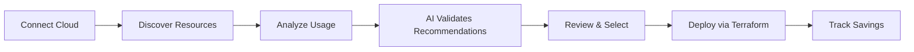

# How JetScale Works

> Transform cloud costs into savings with AI-powered optimization

## Overview

JetScale automatically discovers cost-saving opportunities in your cloud infrastructure and delivers them as production-ready Terraform code. This guide explains the JetScale platform workflow—what happens when you connect your cloud account and how you get actionable savings.

---

## The JetScale Process



### 3-Step Workflow

1. **Connect** → Grant read-only cloud access
2. **Review** → Browse AI-validated recommendations with savings estimates
3. **Deploy** → Get Terraform code via pull request, merge, and save

---

## 1. Connect Your Cloud Account

**What You Do:**
- Grant JetScale read-only access to your AWS or Azure environment
- No write permissions—JetScale never modifies your infrastructure directly
- Takes 5 minutes with our step-by-step guides

**How Security Works:**
- **AWS**: Cross-account IAM role with External ID verification
- **Azure**: Service Principal with certificate authentication
- **Zero credentials stored**: Everything uses temporary, scoped tokens
- **Read-only permissions**: JetScale can only view resource metadata and metrics

**What JetScale Needs:**
- AWS: IAM Role ARN and External ID
- Azure: Tenant ID, Subscription ID, Service Principal credentials

[AWS Setup Guide](aws-setup.md) | [Azure Setup Guide](azure-setup.md)

---

## 2. Discover Resources

**What JetScale Finds:**

**Compute Resources:**
- EC2 instances (all types and families)
- Azure Virtual Machines
- Auto Scaling Groups
- Reserved Instance coverage gaps

**Databases:**
- RDS instances (all engines: MySQL, PostgreSQL, SQL Server)
- Aurora clusters
- Azure SQL databases
- Read replicas and multi-AZ configurations

**Storage:**
- EBS volumes (all types: gp2, gp3, io1, io2)
- Snapshots and backups
- Azure Managed Disks

**Caching:**
- ElastiCache (Redis, Memcached)
- Azure Cache for Redis

**Discovery Process:**
- Scans all regions in your account automatically
- Catalogs resource configurations and relationships
- Identifies tagging patterns and organizational structure
- Updates daily to catch new resources and changes

---

## 3. Analyze Usage Patterns

**Historical Data Collection:**

JetScale pulls comprehensive usage data from:
- **AWS CloudWatch** or **Azure Monitor** metrics
- **Cost Explorer** or **Azure Cost Management** APIs
- Performance metrics (CPU, memory, network, disk I/O)
- Cost data (current spend, RI utilization, Savings Plans)

**Performance Metrics Tracked:**
- CPU utilization (average, p50, p95, p99, max)
- Memory utilization and pressure
- Network throughput and packet rates
- Disk IOPS and throughput
- Database connections and query patterns
- Cache hit/miss ratios

**Pattern Recognition:**

JetScale's AI classifies workloads:

| Pattern | Characteristics | Optimization Strategy |
|---------|-----------------|----------------------|
| **Steady-State** | Consistent utilization | Reserved Instances, right-sizing |
| **Bursty** | Low average, high peaks | Burstable instances (T3/T4g) |
| **Scheduled** | Regular on/off patterns | Scheduling automation |
| **Idle** | Minimal utilization | Shutdown or significant downsize |
| **Over-Provisioned** | High capacity, low usage | Right-sizing opportunities |

---

## 4. AI-Validated Recommendations

**What Makes JetScale Different:**

Unlike generic cost tools that simply alert you to low CPU usage, JetScale's AI understands the nuances of each cloud service:

**For Databases:**
- Multi-AZ failover patterns and capacity requirements
- Read replica lag tolerances
- Connection pooling behavior
- Query workload characteristics

**For Compute:**
- Burstable instance credit balance patterns
- Auto Scaling Group headroom requirements
- Load balancer health check configurations
- Graviton migration compatibility

**For Storage:**
- IOPS burst patterns vs sustained throughput
- Volume type performance characteristics
- Snapshot lifecycle optimization

**Recommendation Types:**

| Type | What You Get | Example Savings |
|------|--------------|-----------------|
| **Right-sizing** | Adjust capacity to match actual usage | 30-50% per resource |
| **Reserved Instances** | Purchase commitments for predictable workloads | 40-60% vs on-demand |
| **Graviton Migration** | Move to ARM-based AWS Graviton instances | 30-40% same performance |
| **Storage Optimization** | Upgrade volume types or adjust IOPS | 20-30% (e.g., gp2→gp3) |
| **Scheduling** | Stop/start resources during off-hours | 65-75% for non-prod |
| **Cleanup** | Remove unused resources | 100% for zombie resources |

**Every Recommendation Includes:**
- **Estimated monthly savings**: Detailed cost breakdown
- **Performance impact assessment**: Zero-downtime or minor adjustments noted
- **Implementation risk level**: Low, Medium, or High with specific risks
- **Before/after comparison**: Side-by-side configuration view
- **Supporting evidence**: Historical usage charts and metrics
- **Rollback instructions**: Easy path back if needed

**Safety Validation:**

Before recommending any change, JetScale validates:
- **Minimum 20% CPU headroom** above historical peak
- **Minimum 15% memory headroom** above peak usage
- **High-availability requirements** preserved (multi-AZ, replicas)
- **Performance SLAs** maintained
- **Sufficient capacity** for traffic spikes and growth

---

## 5. Review & Select Recommendations

**Dashboard View:**

Recommendations are organized by:
- **Potential savings** (highest to lowest)
- **Risk level** (prioritize low-risk quick wins)
- **Resource type** (EC2, RDS, EBS, etc.)
- **Cloud account** (if managing multiple accounts)

**Recommendation Details:**

Click any recommendation to see:
- **Summary**: What's changing and why
- **Evidence**: Historical usage charts
- **Configuration Comparison**: Current vs recommended settings
- **Savings Calculation**: Detailed cost analysis
- **Impact Assessment**: Performance and availability considerations
- **Implementation Notes**: Prerequisites and special considerations

**Bulk Selection:**
- Select multiple recommendations for batch implementation
- Filter by criteria (e.g., "all low-risk recommendations > $100/month")
- Preview combined savings across selections

---

## 6. Deploy Changes

**Production-Ready Terraform:**

When you approve recommendations, JetScale generates:
- **Standard HCL format**: Works with Terraform 0.13+
- **Lifecycle blocks**: Safe deployments with create-before-destroy
- **Documentation**: Inline comments explaining each change
- **Rollback instructions**: Easy recovery if needed
- **Savings tracking**: Tags for ROI reporting

**Example Generated Code:**
```hcl
# JetScale Recommendation: REC-2025-001
# Estimated Monthly Savings: $248.16
# Implementation Risk: LOW

resource "aws_instance" "web_server_01" {
  instance_type = "t3.large"  # Changed from t3.xlarge

  lifecycle {
    create_before_destroy = true
  }

  tags = {
    Name                      = "web-server-01"
    JetScaleRecommendation    = "REC-2025-001"
    JetScaleMonthlySavings    = "248.16"
    JetScalePreviousType      = "t3.xlarge"
  }
}
```

**Integration Options:**

**GitHub/Bitbucket:**
- Automatic pull request creation in your repository
- PR includes full documentation, cost analysis, and testing checklist
- Reviewers auto-assigned based on your team settings
- Links back to JetScale dashboard for detailed evidence

**Jira:**
- Automatic ticket creation for tracking
- Custom fields for savings and ROI
- Status syncing with pull requests
- Executive reporting integration

**Manual Download:**
- Download Terraform files as ZIP
- Apply using your existing Terraform workflow
- Full flexibility for custom processes

[GitHub Integration Guide](integrations/github.md) | [Jira Integration Guide](integrations/jira.md)

---

## 7. Track Savings

**Continuous Monitoring:**

After deployment, JetScale tracks:
- **Actual savings vs projected**: Verify accuracy of recommendations
- **Performance metrics post-change**: Ensure no degradation
- **Resource utilization trends**: Spot new optimization opportunities
- **Cumulative savings over time**: Demonstrate ROI to stakeholders

**Reporting & Analytics:**
- Monthly savings dashboard with trend analysis
- Year-to-date totals and ROI calculations
- Resource-level savings attribution
- Export data for executive reporting and FinOps

**Continuous Discovery:**
- **Daily scans** for new optimization opportunities
- **Alerts** when high-value recommendations are available
- **Trend analysis** to identify growing waste
- **Seasonal pattern detection** for scheduled optimizations

---

## Security & Trust

### What JetScale Stores

**Data We Keep:**
- Resource metadata (instance IDs, types, configurations)
- Aggregated usage metrics (configurable retention period)
- Recommendation history and approval status
- User preferences and team settings

**Data We Never Store:**
- Application data or business logic
- Database contents or customer data
- Source code or intellectual property
- IAM credentials (only temporary tokens used)

### Encryption & Compliance

**Data Protection:**
- **At rest**: AES-256 encryption
- **In transit**: TLS 1.3 for all connections
- **Key management**: Separate encryption keys per customer

**Compliance Certifications:**
- **SOC 2 Type II** certified
- **GDPR** compliant (data residency options available)
- **CCPA** compliant
- **Regular security audits** by third-party firms

### Access Control

**Read-Only Permissions:**
- JetScale only needs read access to resource configs and metrics
- No write, delete, or modify permissions granted
- All changes reviewed and deployed by you
- Your code stays in your repositories

**Audit Trail:**
- All API calls logged and available for review
- CloudTrail/Azure Activity Log integration
- Access logs provided on request for security reviews

---

## Why JetScale Saves You Time

**Without JetScale:**
- Manual CloudWatch/Azure Monitor analysis: 8-12 hours/month
- Researching right-sizing options: 4-6 hours/month
- Writing Terraform code: 6-8 hours/month
- Testing and validation: 4-6 hours/month
- **Total**: 22-32 hours/month per engineer

**With JetScale:**
- Review recommendations: 30 minutes/month
- Approve and merge PRs: 30 minutes/month
- Monitor results: 15 minutes/month
- **Total**: 75 minutes/month
- **Time saved**: 95%

---

## Real Customer Results

> "JetScale identified $47,000/month in savings within the first week. The Terraform code worked perfectly on first apply."
> — Platform Engineering Lead, Series B SaaS Company

> "Finally, a tool that understands the difference between safe optimization and reckless cost-cutting. Zero performance incidents."
> — VP of Engineering, E-commerce Platform

**Average Customer Metrics:**
- **35% reduction** in monthly cloud spend
- **2.3 hours saved** per week on cost analysis
- **78%** of recommendations deployed within 30 days
- **Zero performance incidents** from JetScale changes
- **ROI achieved** within first 60 days

---

## Next Steps

**Get Started:**
1. [Connect AWS Account](aws-setup.md) (5 minutes)
2. [Connect Azure Account](azure-setup.md) (5 minutes)
3. [Configure Integrations](integrations/README.md) (GitHub, Jira, Slack)

**Learn More:**
- [AI Analysis Deep Dive](ai-analysis.md) - How our AI validates safety
- [Supported Services](services/README.md) - What JetScale optimizes
- [FAQ](faq.md) - Common questions answered

**Need Help?**
- Email: [support@jetscale.ai](mailto:support@jetscale.ai)
- Live chat in dashboard
- [Schedule Demo](https://jetscale.ai/demo)

---

*Last Updated: January 29, 2025*
