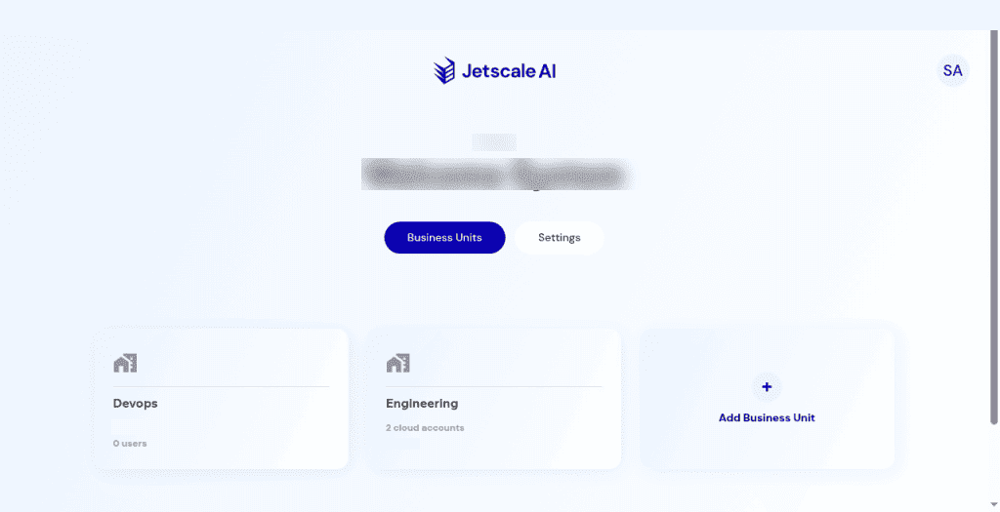

# Business units

Company home: business-unit cards, the license banner, and adding a unit.

## What it is

The company home lists business-unit cards. Each card shows the unit name, how many cloud accounts it has, and how many users it has. **Add Business Unit** opens a create dialog. Choosing a card opens that unit in the workspace.

## Who it is for

Company owners and admins who organize work by business unit.

## How to use it

1. Open the company portal. The header marks **Business Units** as the current page.
2. Read each card: name, cloud-account count, and user count.

   

   **Non-production console**

3. To inspect create without saving, choose **Add Business Unit**. The dialog is **Create a new business unit**, with name, description, owner, and an optional logo. Choose **Cancel** or the close control. The list does not change.
4. Choose a card to open that unit's cloud accounts in the workspace.

   

   **Non-production console**

**Cancel** closes the dialog and does not add a business unit.

## What to expect

The company name stays in the header. A company can show **No active license** and still list its business-unit cards. The cards stay visible.

An empty company still offers **Add Business Unit**.

## Related screens

- [Cloud accounts](../main/cloud-accounts.md) after you open a unit.
- [Profile and business unit switch](../main/profile-and-business-unit-switch.md) to move between units later.

## Limits

**No active license** is a status on the company. Business-unit cards stay on the page.
