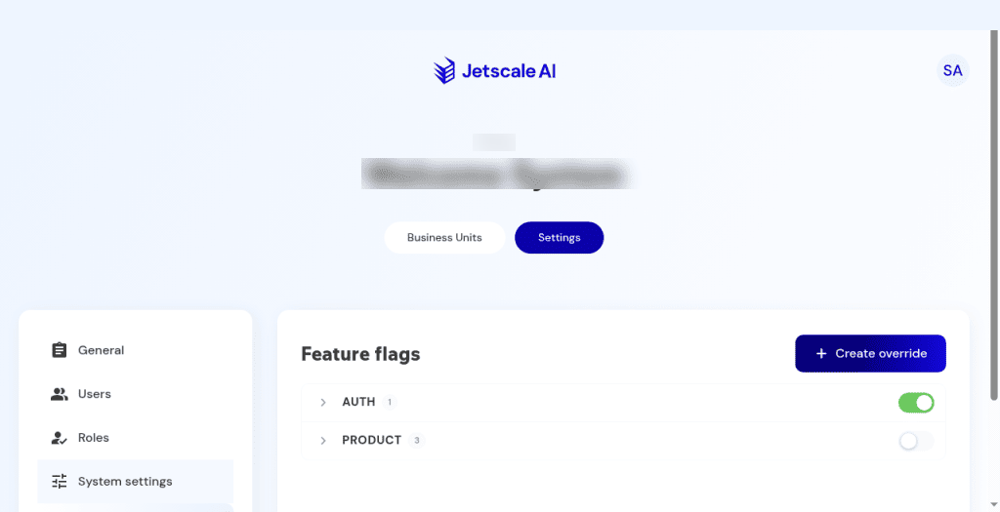

# Feature flags

Company feature-flag groups and override cancel.

## What it is

Company overrides for feature flags, grouped for example under authentication and product. A company override does not by itself turn a flag on everywhere. The flag still has to be allowed at the platform, the company, and the business unit before an account override can make it effective.

## Who it is for

Company admins coordinating a rollout.

## How to use it

1. Open **Settings**, then **Feature flags**.
2. Expand a group to read the current switches. Expanding does not save a change.

   

   **Non-production console**

3. Choose **Create override** to inspect the dialog. The helper text says the key must already exist on the platform registry and that this creates an override for the company only. Choose **Cancel**. Nothing is added.

## What to expect

The groups you see depend on the company. Expanding a group does not save a change.

A company override cannot bypass a flag that is disabled at the platform or at the business unit.

## Related screens

- [Business unit settings](../main/business-unit-settings.md)
- [System settings](system-settings.md) for key-value settings, which are separate.

## Limits

A company override cannot turn on a flag that is disabled for the platform or the business unit. **Cancel** on **Create override** adds nothing.
