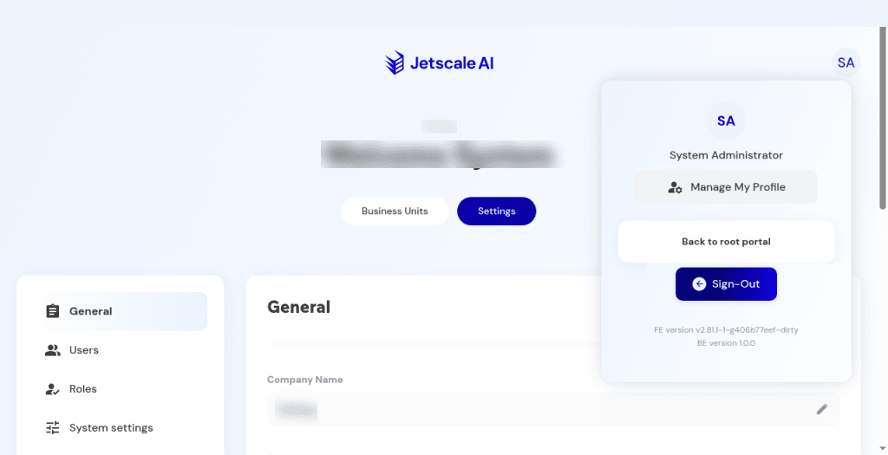

# Profile

The avatar menu in the company portal.

## What it is

The avatar menu in the company portal. It opens **Manage my profile** and **Sign out**.

## Who it is for

Anyone signed into the company portal.

## How to use it

1. Choose the avatar at the top right.
2. **Manage my profile** opens identity fields. Save only when you mean to keep a change.
3. **Sign out** ends the session. Use it only when you mean to leave.

   

   **Non-production console**

## What to expect

Opening the menu does not change company data. Version labels may appear for support. You open the workspace by choosing a business unit, not from **Sign out**.

## Related screens

- [Profile and business unit switch](../main/profile-and-business-unit-switch.md) for the same menu inside the workspace.
- [Business units](business-units.md)

## Limits

The menu shows **Manage my profile** and **Sign out**.
