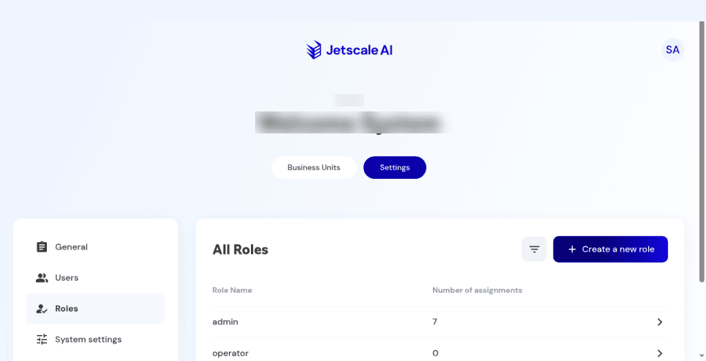

# Roles

Company roles and the permissions they grant, including remediation.

## What it is

The company role catalog, with assignment counts, and a role-details editor. Permissions decide what people can see and do in business units and cloud accounts, including whether they can start a remediation session or send a remediation chat message.

## Who it is for

Company owners and admins who define access.

## How to use it

1. Open **Settings**, then **Roles**.
2. Review each role and its assignment count. A count of zero is still shown.

   

   **Non-production console**

3. Open **Role details** for a role to see grouped switches, including business-unit access, dashboard, cost, cloud accounts, and remediation.
4. Change a switch only when you intend to save it. Closing or cancelling discards unsaved changes.
5. **Create a new role** opens a dialog. **Cancel** adds nothing.

## What to expect

A missing permission hides or denies the matching surface in the workspace. A role that lacks **Start remediation session** cannot start a session from a recommendation that could otherwise be remediated. A role that lacks **Send remediation chat message** cannot send a chat message on a plan or session.

## Related screens

- [Recommendations](../main/recommendations.md)
- [Generate a remediation plan](../main/generate-remediation.md)
- [Remediation sessions and agent chat](../main/remediation-sessions-and-agent-chat.md)

## Limits

**Cancel** on **Create a new role** adds nothing. Closing role details without saving discards unsaved switch changes.
