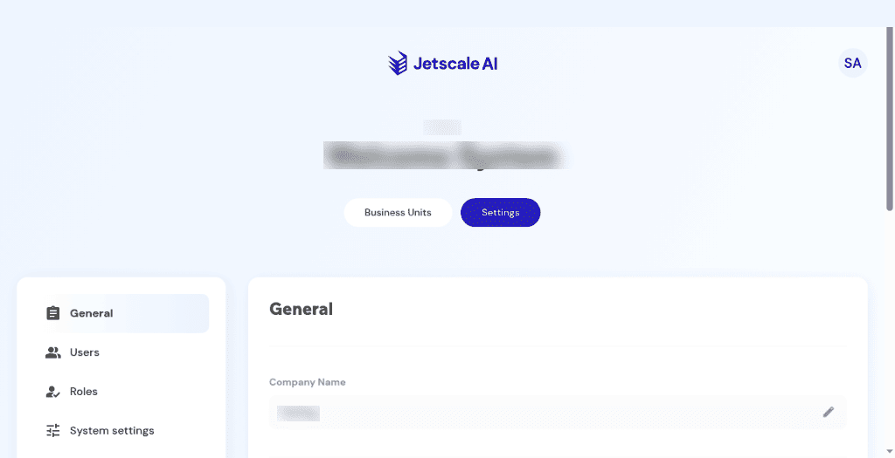

# General settings

Company name, address, and contact fields.

## What it is

Company identity and contact fields: company name, address, postal code, province or state, country, phone, website, domain email, and contact email. Each field has an edit control.

## Who it is for

Company owners and admins who maintain the tenant profile.

## How to use it

1. In the company portal, open **Settings**.
2. Select **General**.
3. Read the fields. Use **Edit** only when you intend to change a value.

   

   
Non-production console · Company general settings.

4. Save only when you mean to keep the change.

## What to expect

Optional fields can show **N/A** until someone sets them. A license banner can stay on the page while you read these fields. Editing general settings does not clear that banner.

## Related screens

- [Business units](business-units.md) for the license banner.
- [Users](users.md) for people, which is separate from these contact fields.

## Limits

Save only when you mean to keep the change. The contact email on the screenshot is hidden.
