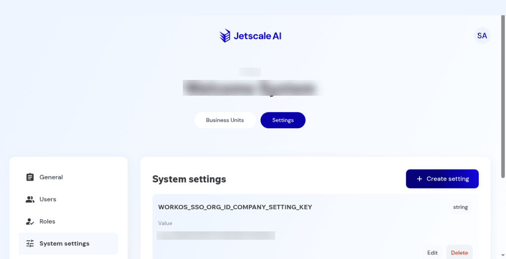

# System settings

Company configuration values, including create and cancel.

## What it is

A company-scoped list of configuration values. It is not cloud-account settings, and it is not the FOCUS billing export.

## Who it is for

Company admins who review or add company-level settings.

## How to use it

1. Open **Settings**, then **System settings**.
2. Read existing rows. Opening the page does not change a value.
3. Choose **Create setting** to inspect the dialog: key, value type, and value. Choose **Cancel**. Nothing is added.

## What to expect

**Cancel** closes the dialog and leaves the list unchanged. The form does not show cloud-account recommendation metrics. The screenshot hides the organization identifier value. The setting name stays visible.

Non-production console · Company system settings. The organization identifier value is blurred.

## Related screens

- [Feature flags](feature-flags.md) for rollout switches, which are a different list.
- [Cloud account settings and FOCUS](../workspace/cloud-account-settings-and-focus.md) for one linked account.

## Limits

**Cancel** on **Create setting** adds nothing. Identity-provider values are not restated here.
