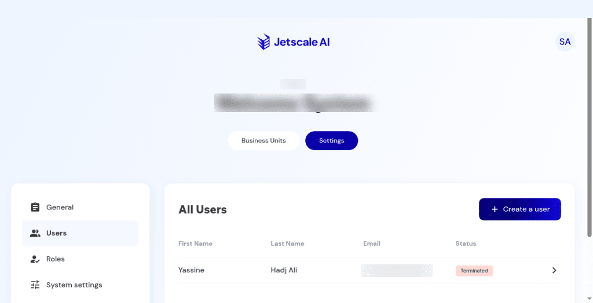

# Users

The company user directory and the create-user dialog.

## What it is

The company-wide user directory, plus **Create a user**. This is not business-unit user management, and it is not an owner invitation started from a platform company card.

## Who it is for

Company owners and admins who manage company-scoped people.

## How to use it

1. Open **Settings**, then **Users**.
2. If the list is empty, read the empty-state copy. **Create a user** stays available.
3. If the list has rows, read first name, last name, email, and status.

   

   
Non-production console · Company users table. The email address is blurred.

4. Choose **Create a user** to open the dialog. It asks for an email and for business-unit and role access. An empty email shows the toast **Please enter an email address.** Choose **Cancel** to leave the list unchanged.

## What to expect

The directory can be empty. **Create a user** stays available. **Cancel** adds nothing. Browsing the directory does not create a user.

## Related screens

- [Roles](roles.md) for the permissions a role grants.
- [Business unit settings](../workspace/business-unit-settings.md) for users scoped to one unit.

## Limits

**Cancel** on **Create a user** adds nothing. Email addresses on the screenshot are hidden.
