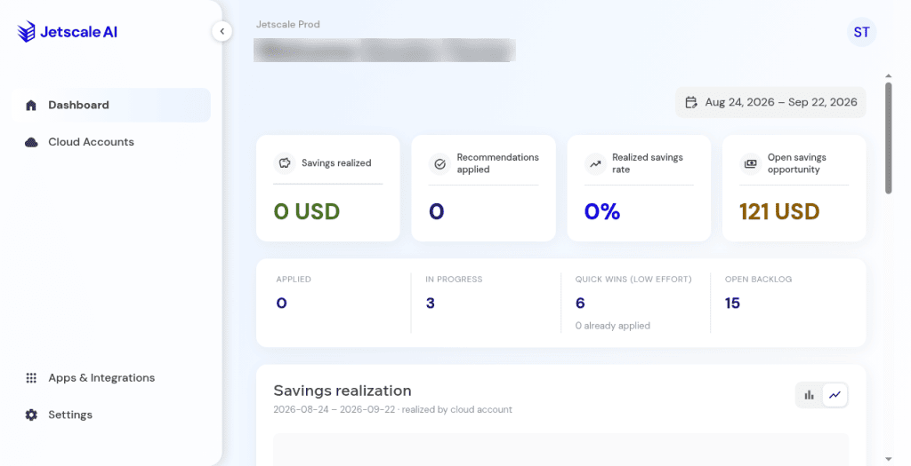

# Environment notes

Menu and console differences you may see while using the company portal and the workspace.

## What it is

Notes on differences between consoles. The other product pages describe how to use each screen. This page records what can differ from one console to another.

## Who it is for

Operators and support staff who see a menu, a tab, or a status that does not match another console.

## How to use it

Use the task page for the screen you are on. Use this page when a menu item, a tab, or a status control is missing or looks different.

## What to expect

**Menus.** A business-unit menu can include Dashboard, Cloud accounts, Apps, and Settings. Dashboard or Apps can be absent. An account menu can include Overview, Cost breakdown, Resources, Recommendations, Remediation, and Settings. Resources can be absent on an account that still has recommendations.

**Company access.** Company settings are for administrators. A role without that access does not see them. That does not remove the settings from the product.

**Business-unit settings.** The tabs are General, User management, and System settings. A Feature flags tab can also appear.

**Cost and FOCUS.** Cost breakdown can show spend when FOCUS is **Not configured**. Cost breakdown can also be empty when FOCUS is **Not configured**. An empty cost breakdown does not mean there are no recommendations.

**Production console**

**Dashboard range.** Choosing last 30 days moves every panel on the dashboard together. That range can show zeros.

**Production console**

**Recommendation status.** Status is a pill, with filters for Discovered, In progress, Completed, Postponed, and Discarded. Generating a plan moves the status to **In progress**. On some consoles, choosing the pill opens **Change recommendation status**. **Cancel** leaves the status unchanged.

**License.** A company can show **No active license** and still list its business units. The cards stay visible.

## Related screens

- [Dashboard](main/dashboard.md)
- [Cost breakdown](main/cost-breakdown.md)
- [Cloud account settings and FOCUS](main/cloud-account-settings-and-focus.md)
- [Business units](company/business-units.md)

## Limits

These notes describe what the consoles can show. They do not change the steps on the task pages.
