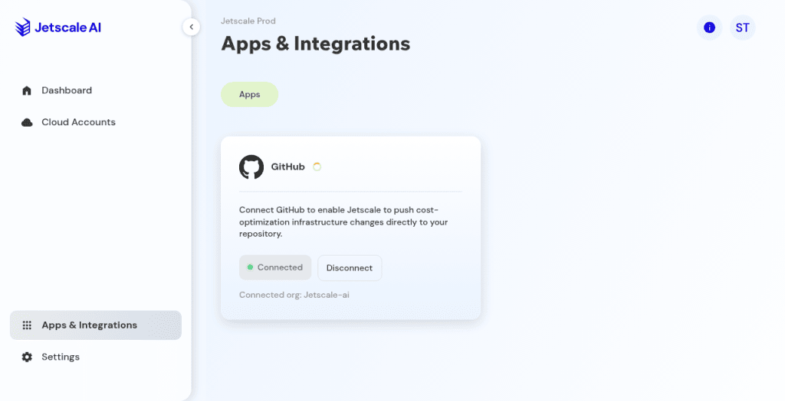

# Apps and integrations

Connected apps such as GitHub, as shown in the workspace.

## What it is

Apps and integrations is where a business unit connects tools that can deliver a change, for example GitHub. The page shows connection state. This guide does not require you to disconnect anything.

## Who it is for

Operators checking whether a repository connection exists before they expect a pull request from remediation.

## How to use it

1. Open **Apps & Integrations** when it is in the business-unit sidebar.
2. Read the GitHub card: connected or not, and the connected organization when one is shown.

   

   **Production console**

3. Leave **Disconnect** unused unless you intend to remove the connection.

## What to expect

A connected GitHub app is what would let Jetscale open a pull request. When no connection exists, a generated plan still shows the steps file and the Terraform file. Open **Apps & Integrations** when it is in the sidebar.

## Related screens

- [Generate a remediation plan](generate-remediation.md)

## Limits

Without a GitHub connection, the plan artifacts are the steps file and the Terraform file. Leave **Disconnect** unused unless you intend to remove a connection.
