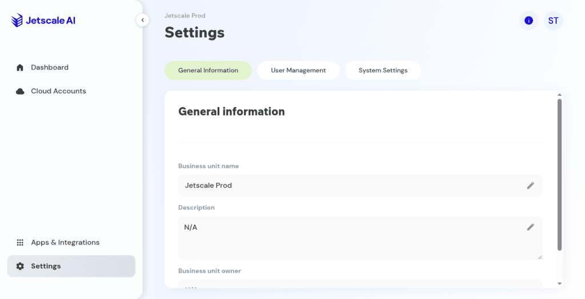

# Business unit settings

General, users, and system settings for one business unit.

## What it is

Settings for the current business unit: general information, user management, and system settings. These are not company settings, and they are not the cloud account's FOCUS export.

## Who it is for

People who administer one business unit.

## How to use it

1. In the workspace, open **Settings** for the business unit.
2. **General** shows the unit name, description, and owner.

   

   **Production console**

3. **User management** lists people on this unit. It can be empty. Creating a user here is not the same as [company users](../company/users.md).
4. **System** is the unit's own settings list.
5. The tabs are **General**, **User management**, and **System**. A **Feature flags** tab can also appear.

## What to expect

Reading these tabs does not link a cloud account. **Cancel** on a create dialog adds nothing.

## Related screens

- [Company users](../company/users.md)
- [Feature flags](../company/feature-flags.md)
- [Cloud account settings and FOCUS](cloud-account-settings-and-focus.md)

## Limits

**Cancel** on a create dialog adds nothing. Company users and business-unit users are separate lists.
