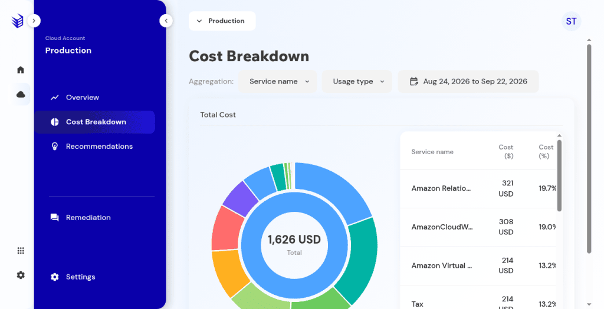
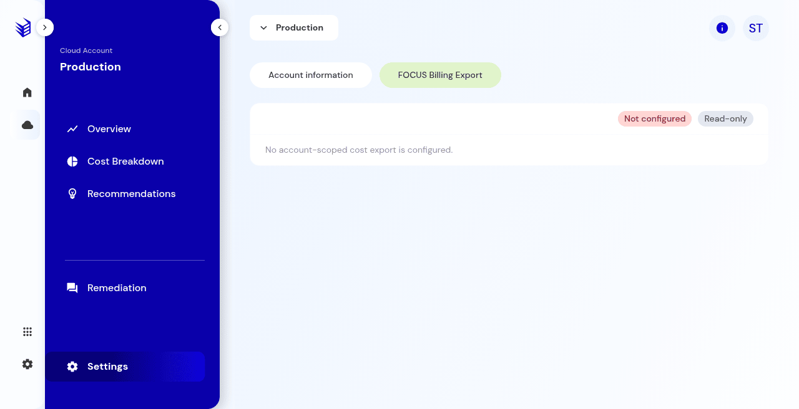

# Cost breakdown

Where account spend sits, and how that relates to FOCUS.

## What it is

Cost breakdown shows spend for the open cloud account, by service or by a second grouping such as usage type. It is separate from recommendation savings.

## Who it is for

Operators who need to see where spend sits before they prioritize recommendations.

## How to use it

1. Open the account and choose **Cost breakdown**.
2. Read the total and the service rows for the active date range.

   

   **Production console**

3. Change grouping when the control is offered. The table updates. No export is created by reading it.
4. If the page says no cost breakdown data is available, check [FOCUS](cloud-account-settings-and-focus.md).

## What to expect

Cost breakdown can show spend when FOCUS is **Not configured**. An empty breakdown does not mean there are no recommendations.

**Production console**

## Related screens

- [Cloud account settings and FOCUS](cloud-account-settings-and-focus.md)
- [Overview and governance](overview-and-governance.md)

## Limits

An empty cost breakdown does not mean the recommendations list is empty. Savings estimates can exist when cost breakdown does not.
