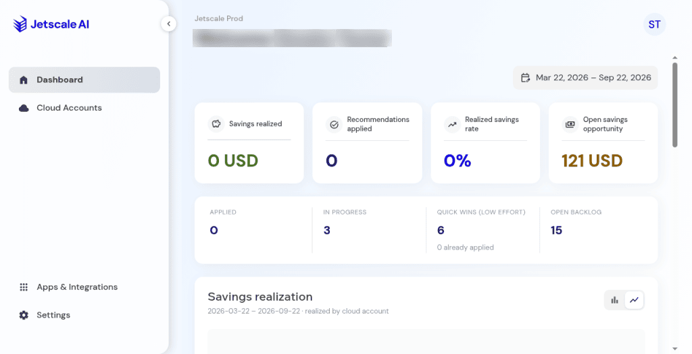

# Dashboard

The business-unit summary in the workspace.

## What it is

The business-unit dashboard summarizes linked accounts, opportunity, and governance for the unit you are in. Open it when **Dashboard** is in the sidebar.

## Who it is for

Operators who want the unit-level picture before they open one account.

## How to use it

1. Open a business unit in the workspace.
2. Choose **Dashboard** when it is in the sidebar.
3. Read the tiles and chart for the active date range. Switching bar and line keeps that range.

   

   **Production console**

4. Use a date preset, including last 30 days, to move every panel on the page together.

## What to expect

Figures belong to the current business unit. Switching business unit changes what you see. A date preset, including last 30 days, moves every panel on the page together.

## Related screens

- [Cloud accounts](cloud-accounts.md)
- [Overview and governance](overview-and-governance.md)

## Limits

A dashboard total is the console's current summary for that range. It is not a certified savings outcome.
