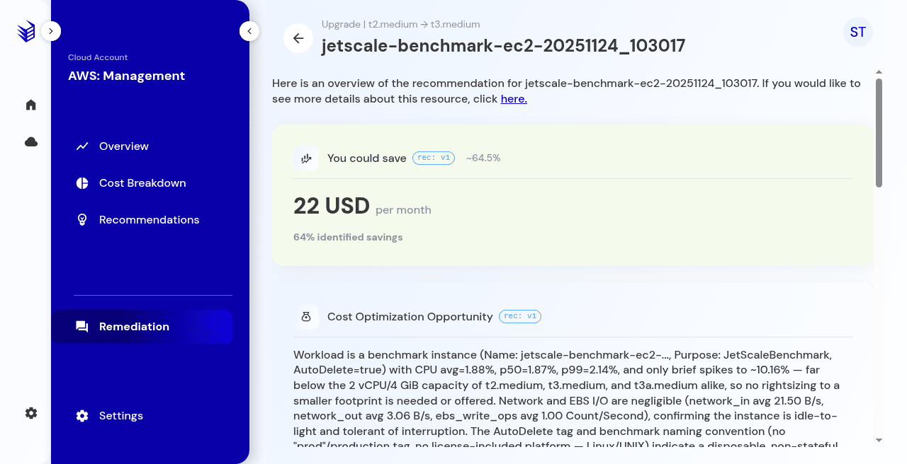
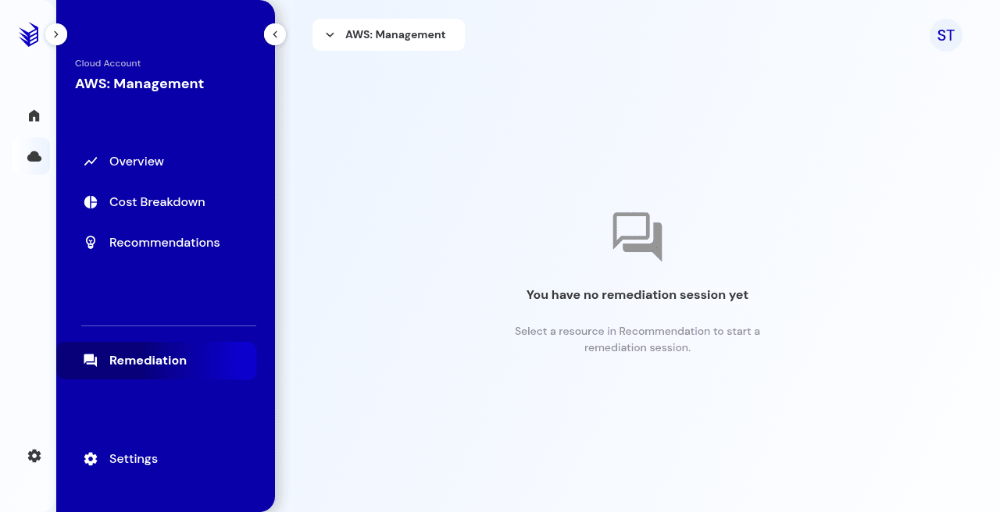
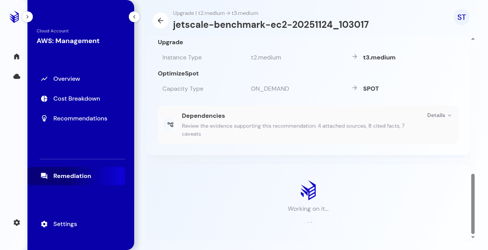
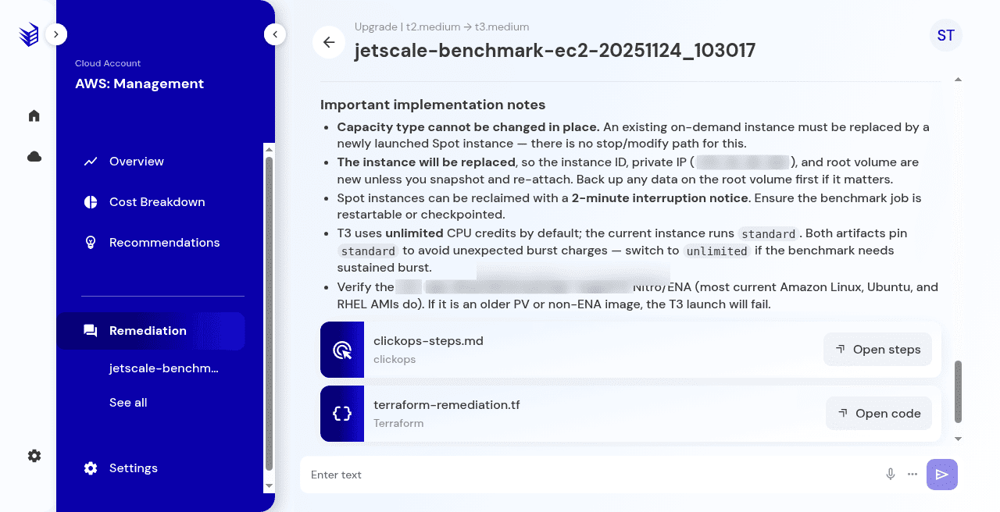

# Generate a remediation plan

The yes or no gate, progress, and the reviewable plan.

## What it is

Generate turns a recommendation into a plan you can read: a summary, why it is safe, notes, click-operations steps, and a Terraform file. Generating a plan does not apply the change to the cloud.

## Who it is for

Operators who are allowed to start a remediation session.

## How to use it

1. Open the recommendation and choose **Generate remediation**, **Create remediation plan**, or **View full recommendation**. The label depends on the path.
2. The gate asks **Would you like to generate the remediation plan?** The choices are **1 Yes, generate the plan** and **2 No, don't generate**.

   

   **Production console**

3. **No** leaves the remediation list empty. The empty copy is **You have no remediation session yet.**

   

   **Production console**

4. **Yes** starts generation. Progress text moves through **Generating remediation plan…**, **Hang tight…**, **Crunching the details…**, and **Working on it…** The plan is ready in about a minute. Changing progress text means generation is still running.

   

   **Production console**

5. Read the plan: **Recommendation Summary**, **Why this is safe**, and **Important implementation notes**. Open `clickops-steps.md` with **Open steps** and `terraform-remediation.tf` with **Open code**.

   

   **Production console**

6. The session appears under **Remediation** as a previous remediation session. The recommendation status moves to **In progress**.

## What to expect

Changing progress text for about a minute means generation is still running. Reading the plan does not apply it to your cloud account. The filter drawer's **Apply** control only filters the recommendation list.

If GitHub is not connected, the artifacts are the steps file and the Terraform file. That is expected.

## Related screens

- [Recommendations](recommendations.md)
- [Remediation sessions and agent chat](remediation-sessions-and-agent-chat.md)
- [Apps and integrations](apps-and-integrations.md)

## Limits

Reading the plan does not apply it to your cloud account.
