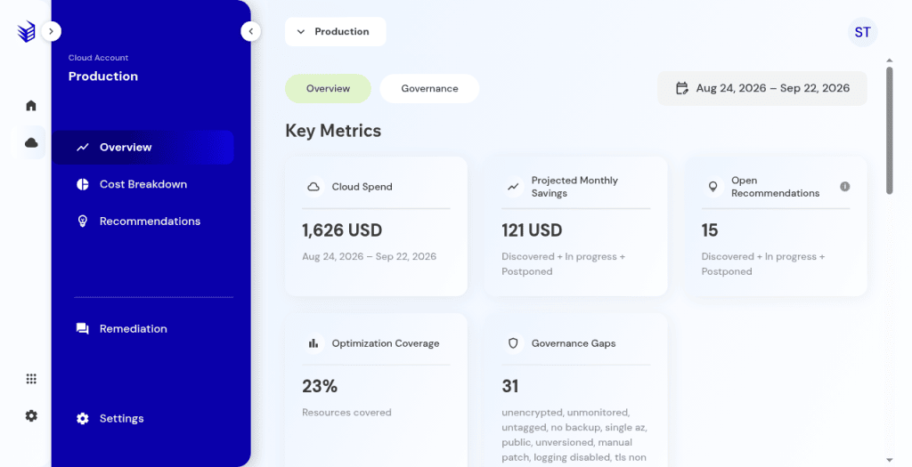
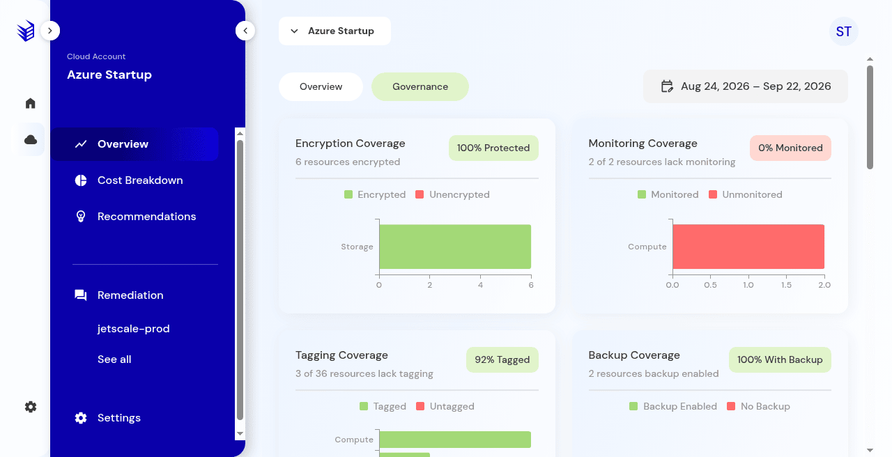

# Overview and governance

Account overview metrics and governance gaps.

## What it is

The cloud account overview: spend, optimization coverage, projected savings, open recommendations, and governance gaps. Governance is the same account area, focused on findings such as encryption, monitoring, tags, backup, and exposure.

## Who it is for

Account reviewers who need the account picture before they open a recommendation.

## How to use it

1. Open a cloud account.
2. Read **Overview** for the active date range.

   

   **Production console**

3. Open **Governance** for the finding categories on that account.

   

   **Production console**

4. Use the open-recommendation count as a pointer into [Recommendations](recommendations.md), then confirm the list.

## What to expect

Open means discovered, in progress, and postponed. It excludes completed and discarded. Use the open count as a pointer into the recommendations list, then read the rows.

## Related screens

- [Recommendations](recommendations.md)
- [Cost breakdown](cost-breakdown.md)
- [Resources](resources.md)

## Limits

Projected savings on this page are the console's figures for the selected range. They are not a certified outcome.
