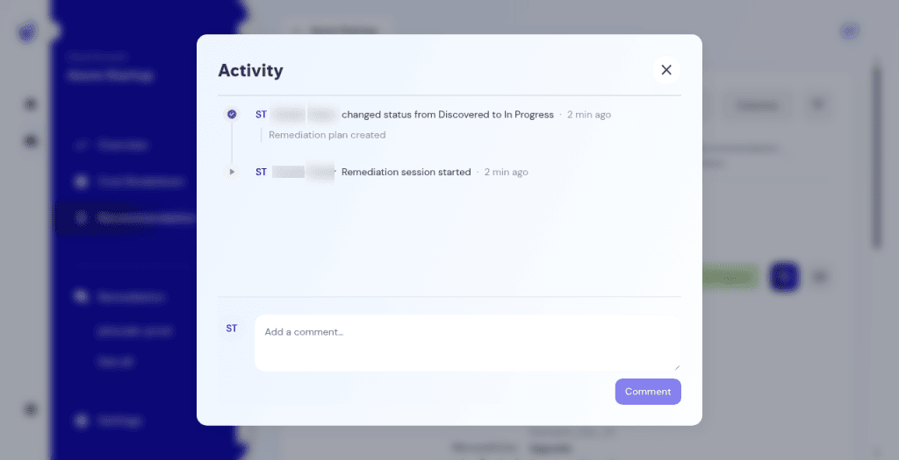
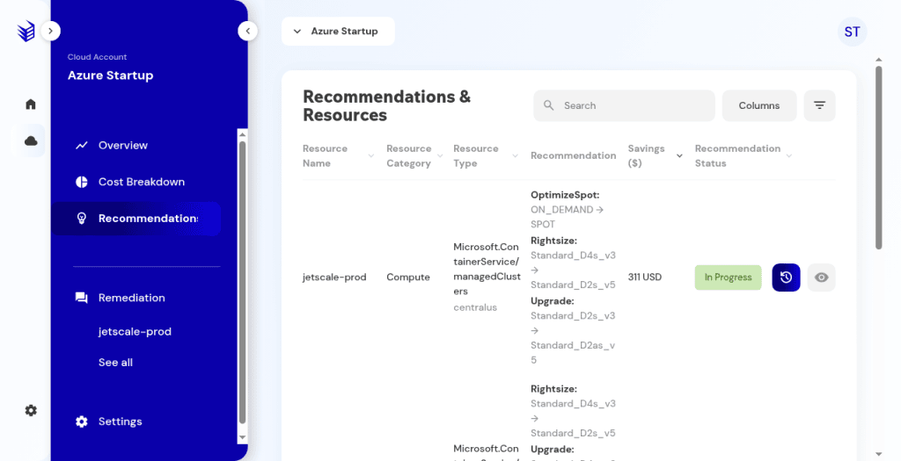
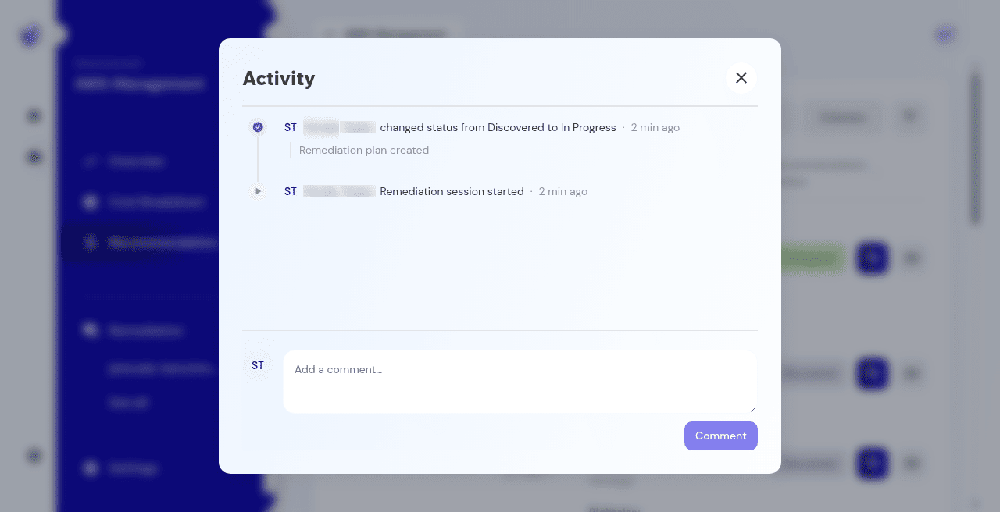

# Activity and status

Recommendation detail, the activity log, and how status changes.

## What it is

The detail for one recommendation: the suggested change, savings, effort, restart and rollback notes, evidence, the activity log, and the way into a remediation plan. The activity log is a comment and event list. It is not the agent chat.

## Who it is for

Operators deciding whether to act, postpone, complete, or discard.

## How to use it

1. From the list, open a row.
2. Read the summary, the linked recommendation, and configuration or changelog when those panels exist.
3. Open **Activity**.
   - Empty copy is **No activity yet.** The composer says **Add a comment…**
   - **Send comment** stays disabled until there is text. Typing a character enables it. Clearing the text disables it again.
   - When events exist, they are append-only: who, when, and what status changed.

   

   **Production console**

4. Status is a pill. Filters list Discovered, In progress, Completed, Postponed, and Discarded. Generating a plan moves the status to **In progress**. On some consoles, choosing the pill opens **Change recommendation status**. **Cancel** leaves the status unchanged.

   

   **Production console**

## What to expect

Opening a recommendation does not change the cloud provider. Chat messages are not copied into the activity log. A changelog can say that no field-level changes were recorded.

**Production console**

## Related screens

- [Recommendations](recommendations.md)
- [Generate a remediation plan](generate-remediation.md)
- [Remediation sessions and agent chat](remediation-sessions-and-agent-chat.md)

## Limits

**Send comment** stays disabled until there is text. **Cancel** on **Change recommendation status** leaves the status unchanged.
