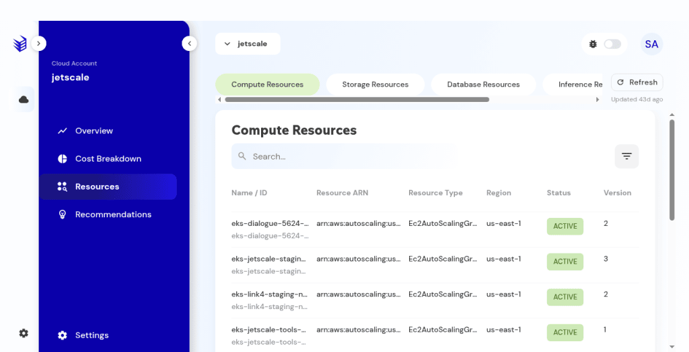
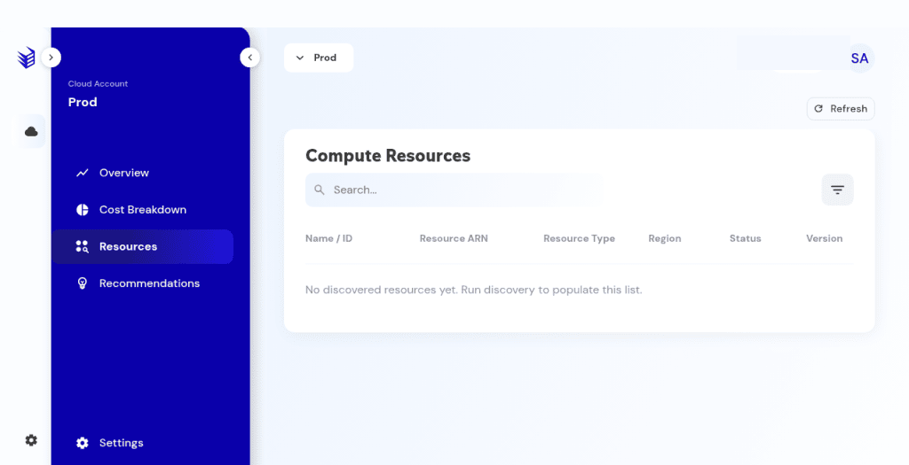

# Resources

Discovered resources when the Resources item is in the account menu.

## What it is

The discovered-resource inventory for one cloud account, split by category: Compute, Storage, Database, Inference, and Network. Open it when **Resources** is in the account menu.

## Who it is for

Operators checking discovery when the menu item is there.

## How to use it

1. If **Resources** is in the account menu, open it.
2. Choose a category tab. The address can keep a hash such as `#compute`.
3. Use search, filter, and refresh. Read last-seen or updated time when it is shown.
4. Read the table: name or id, resource ARN, type, region, status, and version.

   

   **Non-production console**

5. An empty account says no discovered resources yet. Run discovery to populate this list.

   

   **Non-production console**

## What to expect

The table lists name or id, resource ARN, type, region, status, and version. Category totals line up with the overview resource count when Resources is available. Generating a remediation plan is on the recommendation, not on this table.

## Related screens

- [Recommendations](recommendations.md) — Network is a filter category there, and a Resources category here.
- [Overview and governance](overview-and-governance.md)

## Limits

Resources is an inventory of discovered resources. Generating a remediation plan stays on the recommendation.
