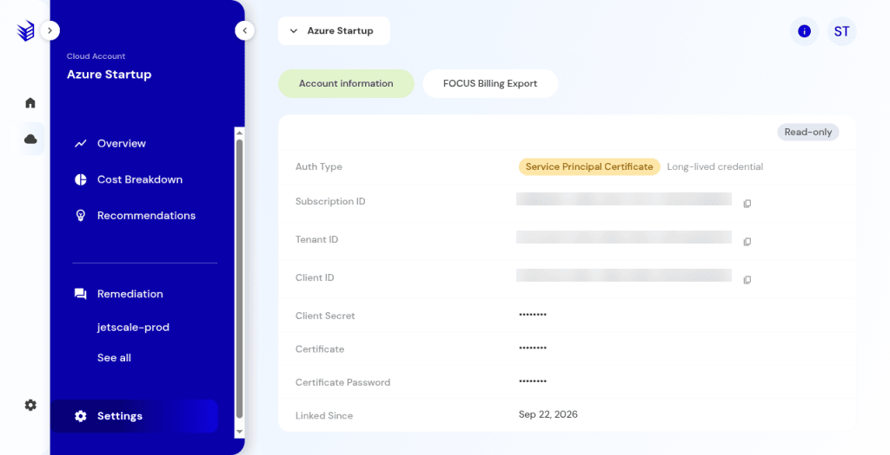
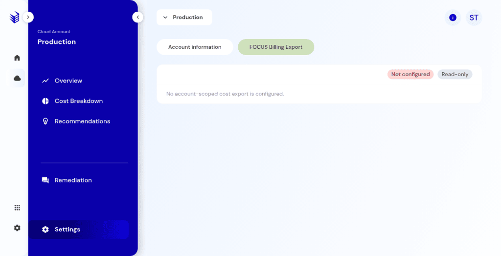

# Cloud account settings and FOCUS

Account connection details and the FOCUS billing export.

## What it is

Settings for one linked cloud account: connection details, and the FOCUS billing export. There is no separate top-level billing item. Both live under the account's **Settings**.

## Who it is for

Account admins who review how the account was linked and whether a cost export exists.

## How to use it

1. Open the account and choose **Settings**.
2. On account information, read the auth type and identifiers. Identifiers on the screenshot are hidden.

   

   
Production console · Cloud account settings. Subscription, tenant, and client identifiers are blurred.

3. Open **FOCUS billing export**. Note whether it says **Not configured**.

   

   
Production console · FOCUS billing export settings.

   

   
Production console · FOCUS billing export not configured.

4. Configure an export only when you intend to set one up. Reading this page does not submit a configuration.

## What to expect

FOCUS can say **Not configured** while [cost breakdown](cost-breakdown.md) still shows spend. An empty cost breakdown does not mean there are no recommendations.

## Related screens

- [Cost breakdown](cost-breakdown.md)
- [Link a cloud account](link-cloud-account.md)
- [Business unit settings](business-unit-settings.md)

## Limits

Reading these settings does not submit a FOCUS configuration. Identifiers on the screenshot are hidden.
