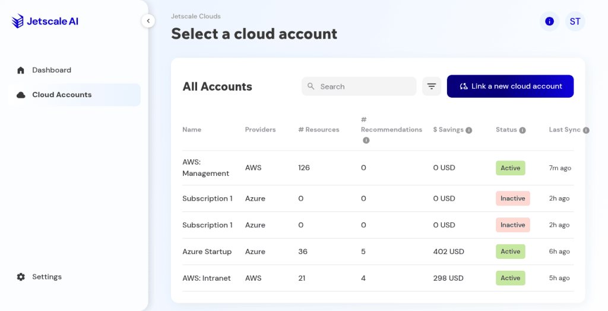
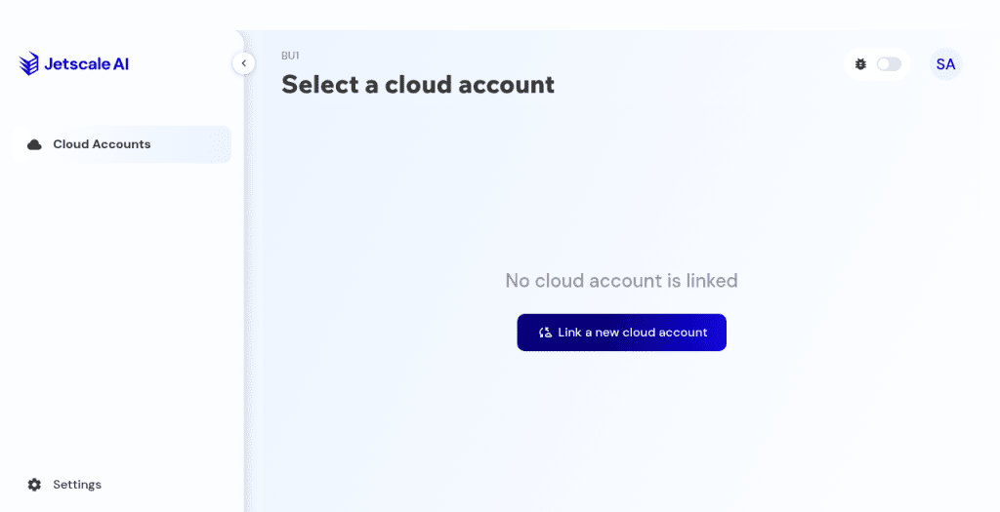

# Cloud accounts

The list of cloud accounts linked to a business unit.

## What it is

The cloud accounts table for the current business unit: name, provider, resource and recommendation counts, savings, status, and last sync. Search and filters narrow the table. They do not link or unlink an account.

## Who it is for

Operators choosing which account to open.

## How to use it

1. Open a business unit. Cloud accounts is the landing list.

   

   
Production console · Cloud accounts table.

1. Search or filter. The row set changes. No account is created.
1. Open a row to enter that account's overview.
1. Use **Link a new cloud account** only when you intend to start linking. Cancel behavior is on [Link a cloud account](link-cloud-account.md).

## What to expect

An empty unit says no cloud account is linked and still offers the link action. Recommendation counts on this table should agree with the account overview.

Non-production console · A business unit with no linked cloud account.

## Related screens

- [Link a cloud account](link-cloud-account.md)
- [Overview and governance](overview-and-governance.md)
- [Recommendations](recommendations.md)

## Limits

Search and filters change which rows you see. They do not link or unlink an account.
