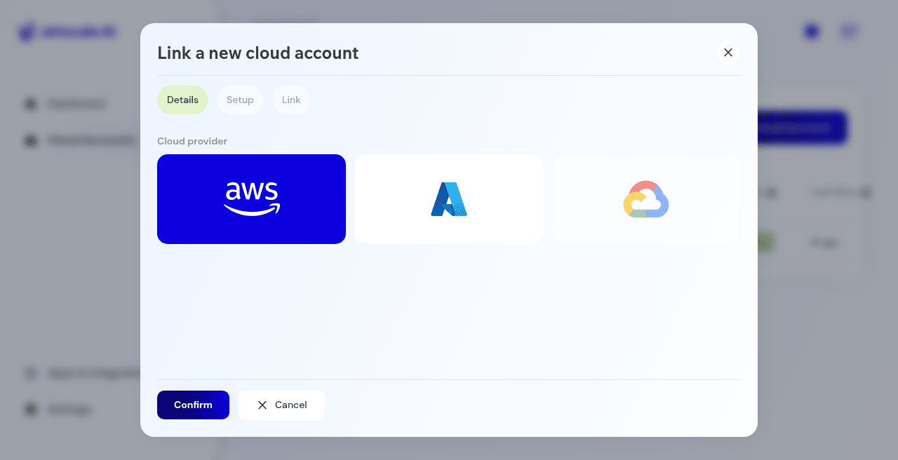

# Link a cloud account

Start linking an account, and cancel without creating one.

## What it is

The wizard that links a cloud account to the current business unit. The first step shows provider cards. Later steps collect setup details. **Cancel** on the details step creates nothing.

## Who it is for

Operators who connect a cloud account.

## How to use it

1. From cloud accounts, choose **Link a new cloud account**.
2. On **Details**, read the provider cards. A production capture showed Amazon Web Services, Microsoft Azure, and Google Cloud, with confirm and cancel. That capture did not show a disabled-provider message.

   

   
Production console · Link a cloud account, details step, with provider cards.

3. Choose **Cancel** if you are only reviewing the form. The account list is unchanged.
4. Continue to setup and link only when you intend to link an account. **Cancel** on the details step adds nothing.

## What to expect

**Cancel** closes the wizard and does not add a row. Google Cloud may be disabled in some releases. The details step in this guide shows the provider cards that were on screen.

## Related screens

- [Cloud accounts](cloud-accounts.md)
- [Cloud account settings and FOCUS](cloud-account-settings-and-focus.md) after an account exists.

## Limits

**Cancel** on the details step adds nothing. Continue only when you intend to link an account.
