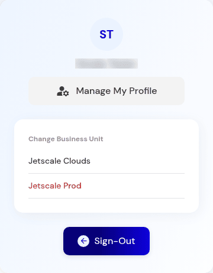

# Profile and business unit switch

Switch business unit from the profile menu in the workspace.

## What it is

The profile menu in the workspace. It lists the business units in the current company, opens **Manage my profile**, can return you to the company portal, and can sign you out.

## Who it is for

Anyone working in the workspace.

## How to use it

1. Open the avatar.
2. Choose **Change business unit**. The current unit is disabled. Other units in this company are listed. A unit from another company is not listed.

   

   
Production console · Profile menu, Change Business Unit.

3. Choose another unit. You land on that unit's cloud accounts. The company stays the same.
4. **Back to company portal**, when it is offered, leaves the business-unit context and does not edit data.
5. **Manage my profile** has General, Password, and Preferences. You can open it and close it without saving.

## What to expect

Recommendations and metrics belong to the unit and account you are in. Switching business unit does not change the cloud account.

## Related screens

- [Cloud accounts](cloud-accounts.md)
- [Profile](../company/profile.md)
- [Savings and remediation loop](../flows/savings-and-remediation-loop.md)

## Limits

Some sessions show only one business unit. The switcher can only list units your user can see in this company.
