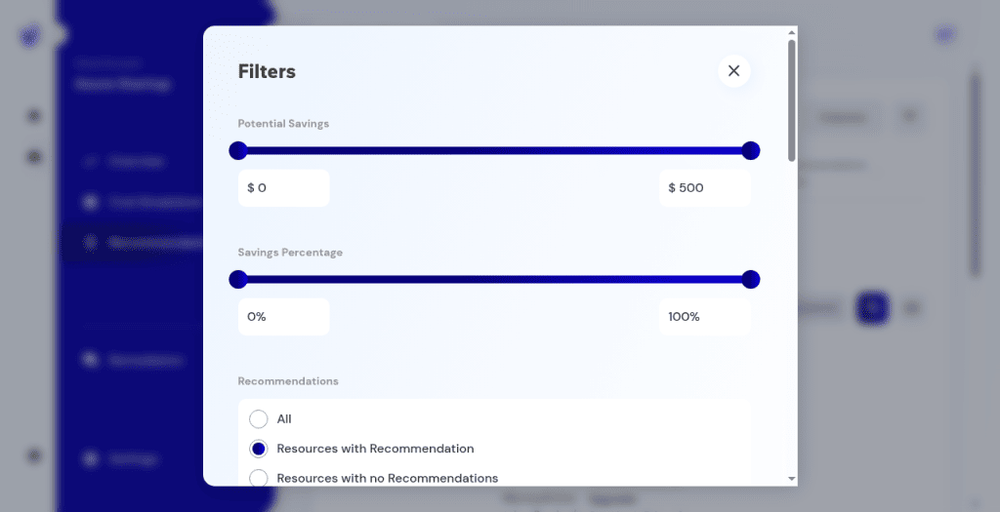
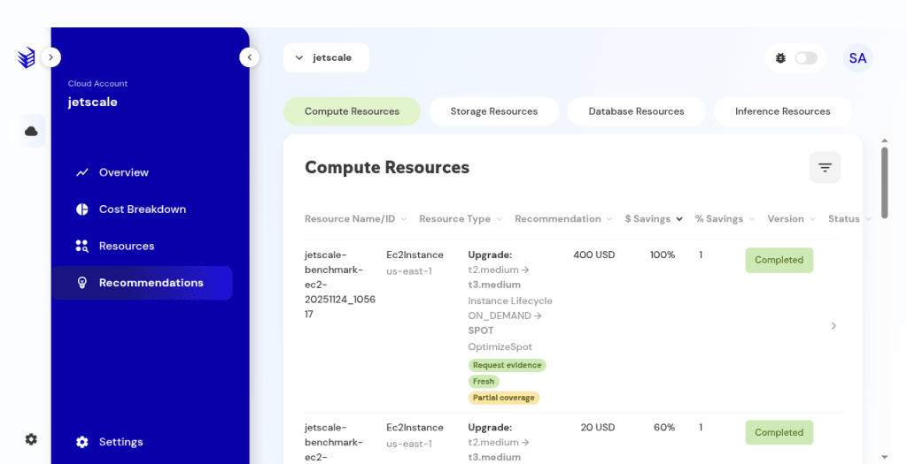
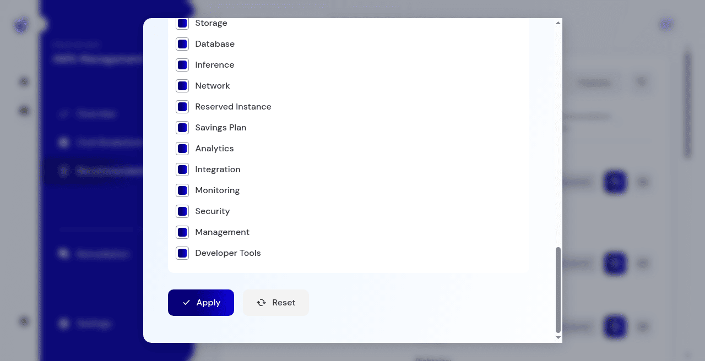

# Recommendations

The recommendation list, columns, and filters.

## What it is

The list of resource-level recommendations: what to change, the estimated savings, the status, and the way into a remediation plan.

## Who it is for

Anyone working the savings loop. Opening the list requires permission to view recommendations.

## How to use it

1. Open the account and choose **Recommendations**. On production the heading is often **Recommendations & Resources**.

   

   
Production console · Recommendations table with category filters.

1. On a build with category tabs, the tabs are **Compute**, **Storage**, **Database**, and **Inference**. There is no Network tab.

   

   
Non-production console · Recommendations on the Compute tab. The tabs are Compute, Storage, Database, and Inference.

1. On a single-table build, use search, the columns menu, the filter drawer, sortable headers, and page size. Observed page sizes include 10, 25, and 50.
1. Open a row for detail. Continue with [Activity and status](recommendation-activity-and-status.md).

**Network** is one of the resource categories inside the filter drawer, together with Compute, Storage, Database, Inference, Reserved Instance, Savings Plan, Analytics, Integration, Monitoring, Security, Management, and Developer Tools. The drawer's **Apply** only applies those filters. It does not apply a change to the cloud.

Production console · Recommendations filter drawer. Network is a filter category, not a recommendations tab.

## What to expect

Open means discovered, in progress, and postponed. It excludes completed and discarded. An empty category says there are no recommendations for that category.

## Related screens

- [Activity and status](recommendation-activity-and-status.md)
- [Generate a remediation plan](generate-remediation.md)
- [Resources](resources.md)

## Limits

Open means discovered, in progress, and postponed. It excludes completed and discarded. The filter drawer's **Apply** only filters this list.
