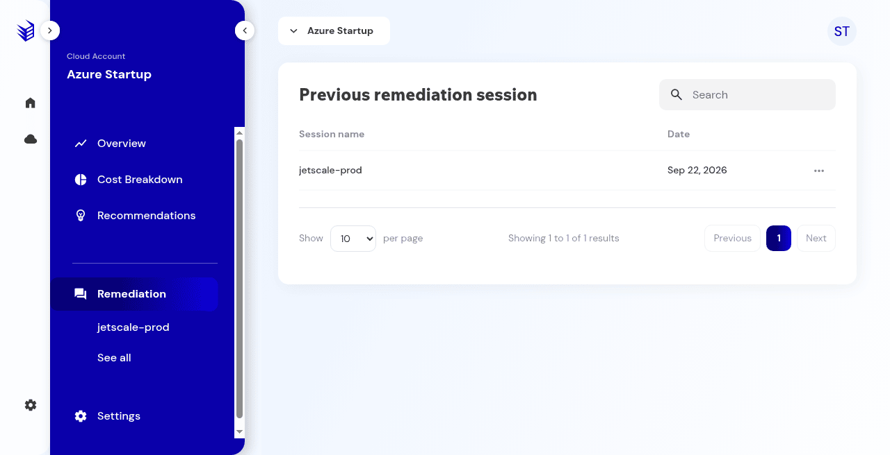
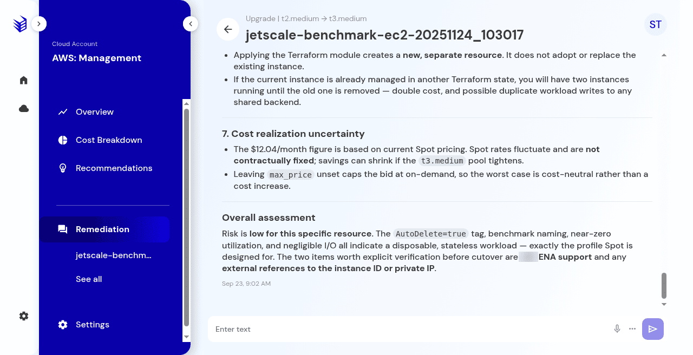

# Remediation sessions and agent chat

The session list and the agent chat, which is not the activity log.

## What it is

The account's remediation sessions, and the agent chat on a generated plan. Chat discusses the plan. The activity log records lifecycle events. They are different surfaces, and chat text is not copied into the activity log.

## Who it is for

Operators reviewing a plan. Sending a chat message requires permission to send remediation chat.

## How to use it

1. Open **Remediation** in the account menu when it is there. You can also open the plan from the recommendation.

   

   
Production console · Remediation session list.

1. After a successful generate, **Previous remediation session** lists the resource and the date.
1. Open the session and read the summary, why it is safe, the notes, and the steps and Terraform files.
1. At the bottom of the plan, the agent chat composer stays disabled until there is text.
1. A documented question was: Summarize the main risks of applying this remediation. The reply listed risks and an overall assessment. That question does not apply the change.

   

   
Production console · Agent chat reply. This thread is not the activity log.

1. Reopen **Activity**. Expect status and session-started events only, for example a status move from Discovered to In progress because a plan was created. The chat question and reply are not in that log.

   

   
Production console · Activity log after chat. Status and session events only.

## What to expect

An empty list tells you to start from Recommendations. A role without **Start remediation session** does not get a session. A role without **Send remediation chat message** does not send chat.

Reading the plan does not apply it to your cloud account.

## Related screens

- [Generate a remediation plan](generate-remediation.md)
- [Activity and status](recommendation-activity-and-status.md)
- [Roles](../company/roles.md)

## Limits

Chat text is not copied into the activity log. Reading the plan does not apply it to your cloud account.
