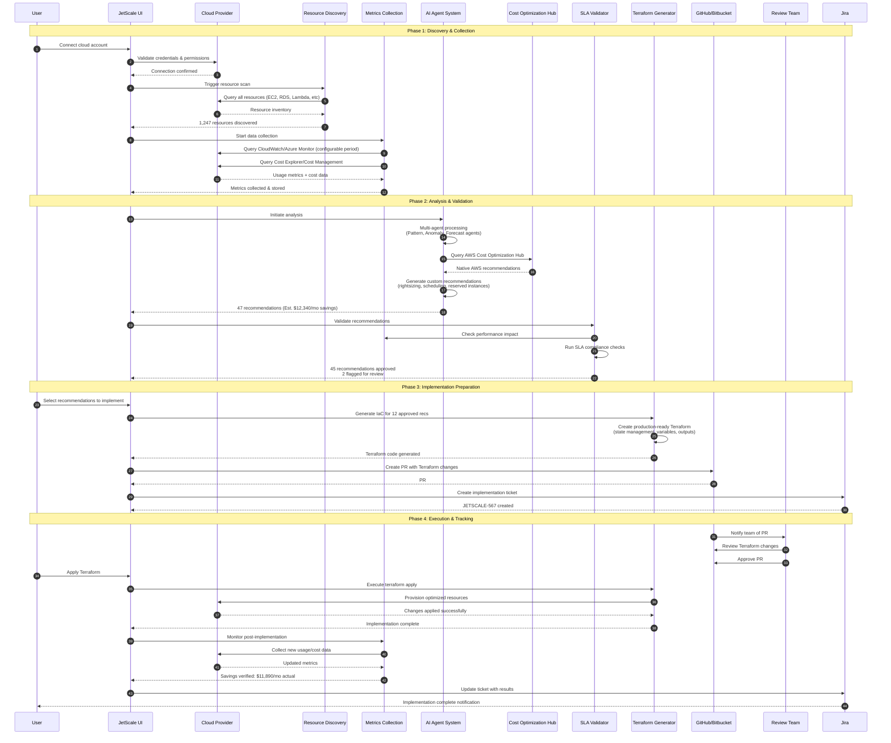
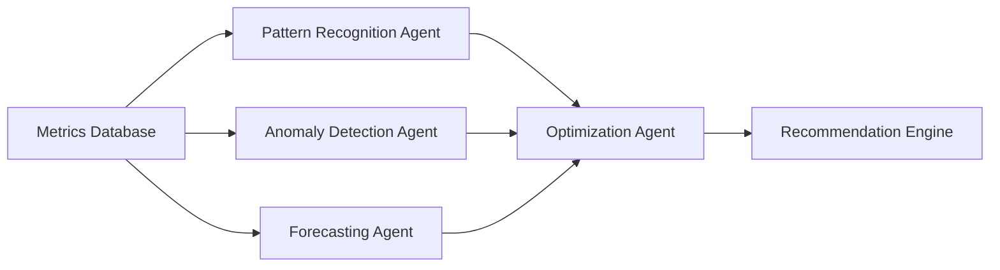
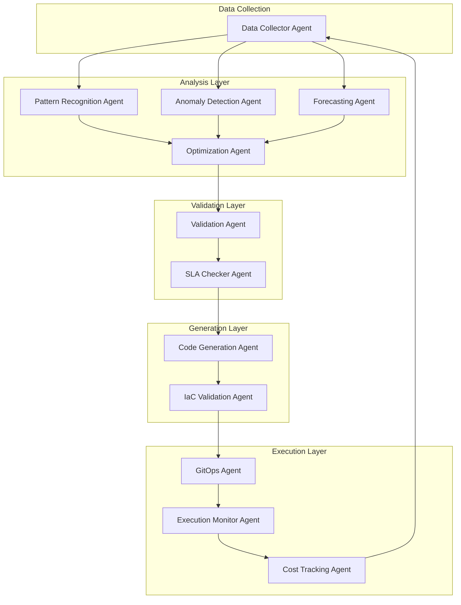

# Recommendation Workflow

> **Complete guide to JetScale's end-to-end cost optimization process**

## Overview

JetScale's recommendation workflow is an intelligent, automated system that continuously identifies, validates, and implements cloud cost optimizations across your AWS and Azure environments. By combining multi-agent AI analysis with production-ready Infrastructure as Code (IaC), JetScale delivers verified savings while maintaining performance and SLA compliance.

### Key Capabilities

- **Automated Discovery**: Continuous scanning of cloud resources across AWS and Azure
- **AI-Powered Analysis**: Multi-agent system processes usage patterns and cost data
- **Validated Recommendations**: Performance and SLA impact assessment before implementation
- **Production-Ready IaC**: Automated Terraform generation for safe deployments
- **GitOps Integration**: Seamless PR-based workflow with GitHub and Bitbucket
- **End-to-End Tracking**: Jira integration for complete audit trail and savings verification

### Workflow Phases

The JetScale recommendation workflow consists of four major phases:

1. **Discovery & Collection** (Steps 1-3): Connect accounts, scan resources, collect metrics
2. **Analysis & Validation** (Steps 4-6): AI processing, recommendation generation, SLA checks
3. **Implementation Preparation** (Steps 7-8): Terraform generation, GitOps PR creation
4. **Execution & Tracking** (Steps 9-11): Review, apply changes, verify savings

---

## Complete Workflow Diagram



---

## Step-by-Step Workflow

### Step 1: Cloud Account Connection

**Objective**: Establish secure connection to AWS and/or Azure accounts

**Process**:

1. Navigate to **Settings > Cloud Accounts**
2. Click **Add Account** and select provider (AWS or Azure)
3. Follow provider-specific setup:
   - **AWS**: Create IAM role with JetScale trust policy, provide Role ARN
   - **Azure**: Register app, grant Subscription Reader + Cost Management Reader
4. JetScale validates credentials and permissions
5. Account appears in dashboard with "Connected" status

**Required Permissions**:

- **AWS**: ReadOnlyAccess, CostExplorerReadOnly, TrustedAdvisor:Describe*
- **Azure**: Reader, Cost Management Reader

**Timeline**: 5-10 minutes

**Related Documentation**:
- [AWS Setup Guide](aws-setup.md)
- [Azure Setup Guide](azure-setup.md)

---

### Step 2: Resource Discovery

**Objective**: Scan and catalog all cloud resources across accounts

**Process**:

1. Automated scan initiates immediately after account connection
2. JetScale queries cloud provider APIs to discover:
   - **Compute**: EC2, Azure VMs, Lambda, App Service
   - **Storage**: EBS, S3, Azure Storage, managed disks
   - **Databases**: RDS, DynamoDB, Cosmos DB, SQL Database
   - **Networking**: Load balancers, NAT gateways, VPN gateways
   - **Containers**: ECS, EKS, AKS, container instances
3. Resources are tagged with metadata (region, type, environment)
4. Inventory is stored and indexed for fast querying

**Discovery Scope**:

- All regions enabled in your account
- All resource types supported by JetScale (100+ AWS, 80+ Azure)
- Resources in all subscription levels (free tier to enterprise)

**Timeline**: 5-30 minutes (varies by account size)

**Output Example**:

```
✓ Discovered 1,247 resources across 3 accounts
  - 342 EC2 instances
  - 89 RDS databases
  - 156 Lambda functions
  - 234 EBS volumes
  - 426 other resources
```

**AI Agents Involved**: None (direct API queries)

---

### Step 3: Data Collection

**Objective**: Gather usage metrics and cost data for analysis

**Process**:

1. JetScale begins continuous metric collection:
   - **CloudWatch/Azure Monitor**: CPU, memory, network, disk I/O
   - **Cost Explorer/Cost Management**: Daily cost breakdowns
   - **Service-specific metrics**: Lambda invocations, RDS connections, etc.
2. Historical data collected for configurable period
3. Metrics aggregated at multiple intervals (5min, 1hr, 1day)
4. Data normalized and stored in time-series database

**Metrics Collected**:

| Resource Type | Key Metrics |
|---------------|-------------|
| EC2/VM | CPU utilization, memory, network I/O, disk I/O |
| RDS/SQL | Connections, CPU, storage, IOPS, read/write latency |
| Lambda | Invocations, duration, memory usage, errors |
| EBS/Disk | IOPS, throughput, volume type |
| S3/Storage | Requests, data transfer, storage class usage |

**Timeline**: Continuous (initial baseline: 24-48 hours)

**Data Retention**: 90 days (configurable)

**AI Agents Involved**: None (direct metric collection)

---

### Step 4: AI Analysis

**Objective**: Process metrics using multi-agent AI system to identify optimization opportunities

**Process**:

1. **Pattern Recognition Agent**:
   - Analyzes usage trends over time
   - Identifies idle/underutilized resources
   - Detects recurring patterns (e.g., weekend shutdowns)

2. **Anomaly Detection Agent**:
   - Flags unusual spikes or drops in usage
   - Identifies resources with erratic performance
   - Detects potential misconfigurations

3. **Forecasting Agent**:
   - Predicts future usage based on historical data
   - Models seasonal variations
   - Estimates cost trajectory

4. **Optimization Agent**:
   - Evaluates potential savings opportunities
   - Calculates risk/reward ratios
   - Prioritizes recommendations by impact

**Agent Interactions**:



**AI Models Used**:

- Time-series analysis (ARIMA, Prophet)
- Clustering algorithms (K-means, DBSCAN)
- Neural networks for pattern recognition
- Statistical anomaly detection

**Timeline**: 30-60 minutes for initial analysis, then continuous

**Output**: Structured insights ready for recommendation generation

---

### Step 5: Recommendation Generation

**Objective**: Create actionable, validated cost optimization recommendations

**Process**:

1. **Native Recommendations**:
   - Query AWS Cost Optimization Hub (EC2, RDS, EBS, Lambda)
   - Fetch Azure Advisor recommendations
   - Parse and normalize recommendations

2. **Custom Recommendations**:
   - Generate JetScale-specific optimizations:
     - **Rightsizing**: Instance type changes based on usage
     - **Scheduling**: Stop/start patterns for dev/test resources
     - **Reserved Instances**: Commitment recommendations
     - **Storage Optimization**: S3 lifecycle policies, EBS volume types
     - **Serverless Migration**: Lambda alternatives for low-traffic apps

3. **Recommendation Enrichment**:
   - Add cost savings estimates
   - Calculate implementation effort (low/medium/high)
   - Attach relevant metrics and evidence
   - Include rollback procedures

**Recommendation Categories**:

| Category | Examples | Typical Savings |
|----------|----------|----------------|
| Rightsizing | Downsize overprovisioned instances | 30-50% per resource |
| Scheduling | Stop non-prod resources off-hours | 60-75% for scheduled |
| Commitment | Reserved Instances, Savings Plans | 30-70% long-term |
| Storage | S3 lifecycle, EBS type changes | 40-80% on storage |
| Serverless | Migrate to Lambda/Functions | 70-90% for low-traffic |
| Cleanup | Delete unused resources | 100% per resource |

**Timeline**: 10-20 minutes

**Output Example**:

```yaml
Recommendation ID: REC-2024-001
Type: Rightsizing
Resource: i-0abcd1234efgh5678 (prod-web-server-01)
Current: t3.xlarge (4 vCPU, 16GB RAM)
Recommended: t3.large (2 vCPU, 8GB RAM)
Reason: Avg CPU 12%, Avg Memory 28% over 30 days
Monthly Savings: $62.04 (48% reduction)
Effort: Low
Risk: Low
Evidence: [CloudWatch metrics attached]
```

**AI Agents Involved**: Optimization Agent, Cost Analysis Agent

---

### Step 6: Validation

**Objective**: Verify recommendations won't negatively impact performance or SLAs

**Process**:

1. **Performance Impact Assessment**:
   - Simulate recommended changes against historical load
   - Model peak usage scenarios
   - Calculate performance degradation risk
   - Check against defined thresholds (e.g., CPU <80%)

2. **SLA Compliance Check**:
   - Verify against user-defined SLAs:
     - Response time requirements
     - Availability targets (99.9%, 99.99%)
     - Throughput minimums
   - Flag recommendations that risk SLA violations

3. **Dependency Analysis**:
   - Check for resource dependencies
   - Identify cascading impacts (e.g., scaling groups)
   - Validate network/security group changes

4. **Safety Scoring**:
   - Assign risk score (1-10) to each recommendation
   - Low risk (1-3): Auto-approve eligible
   - Medium risk (4-7): Flag for review
   - High risk (8-10): Require explicit approval

**Validation Rules**:

| Check | Threshold | Action if Failed |
|-------|-----------|------------------|
| CPU headroom | >20% capacity | Flag for review |
| Memory headroom | >15% capacity | Flag for review |
| Peak load handling | Must handle 99th percentile | Block recommendation |
| Availability impact | SLA maintained | Block recommendation |
| Rollback feasibility | Must be reversible <5 min | Flag for review |

**Timeline**: 5-10 minutes per recommendation

**Output**:

```
✓ 45 recommendations validated and approved
⚠ 2 recommendations flagged for manual review:
  - REC-2024-018: May impact peak load (review metrics)
  - REC-2024-031: Reserved Instance commitment (verify usage trend)
✗ 0 recommendations blocked
```

**AI Agents Involved**: Validation Agent, SLA Checker Agent

---

### Step 7: Terraform Generation

**Objective**: Create production-ready Infrastructure as Code for approved recommendations

**Process**:

1. **Code Generation**:
   - Convert recommendations to Terraform HCL
   - Generate modules for each resource type
   - Include variables for environment-specific values
   - Add outputs for tracking and verification

2. **State Management**:
   - Configure remote state backend (S3/Azure Storage)
   - Set up state locking (DynamoDB/Azure Storage)
   - Include workspace configuration for multi-env

3. **Safety Features**:
   - Add `prevent_destroy` lifecycle rules for critical resources
   - Include `create_before_destroy` for zero-downtime changes
   - Generate plan files for review
   - Add rollback instructions in comments

4. **Testing**:
   - Run `terraform validate` on generated code
   - Execute `terraform plan` in dry-run mode
   - Check for syntax errors and warnings

**Terraform Structure**:

```
jetscale-optimizations/
├── main.tf                 # Primary resource definitions
├── variables.tf            # Input variables
├── outputs.tf              # Outputs for tracking
├── backend.tf              # State backend config
├── versions.tf             # Provider versions
├── modules/
│   ├── ec2-rightsizing/    # EC2 instance modifications
│   ├── rds-optimization/   # RDS changes
│   ├── lambda-scheduling/  # Lambda configuration
│   └── storage-lifecycle/  # S3/EBS policies
└── README.md               # Implementation guide
```

**Example Generated Terraform**:

```hcl
# main.tf
resource "aws_instance" "prod_web_server_01" {
  instance_type = "t3.large"  # Changed from t3.xlarge

  lifecycle {
    create_before_destroy = true
  }

  tags = {
    Name                  = "prod-web-server-01"
    JetScaleRecommendation = "REC-2024-001"
    JetScaleSavings       = "62.04"
  }
}

# outputs.tf
output "optimized_instances" {
  value = {
    "prod-web-server-01" = {
      old_type = "t3.xlarge"
      new_type = aws_instance.prod_web_server_01.instance_type
      monthly_savings = 62.04
    }
  }
}
```

**Timeline**: 5-15 minutes per batch of recommendations

**AI Agents Involved**: Code Generation Agent, IaC Validation Agent

---

### Step 8: GitOps Integration

**Objective**: Create pull requests in version control for team review

**Process**:

1. **Repository Setup** (one-time):
   - Connect GitHub or Bitbucket account
   - Select target repository
   - Configure branch strategy (e.g., `jetscale/optimizations/*`)

2. **PR Creation**:
   - Create feature branch from main/master
   - Commit Terraform code with descriptive message
   - Generate PR with detailed description:
     - Summary of recommendations
     - Expected savings and impact
     - Validation results
     - Rollback procedures
   - Add reviewers automatically (configurable)

3. **PR Metadata**:
   - Link to JetScale recommendation dashboard
   - Attach cost analysis charts
   - Include before/after resource configurations
   - Add CI/CD workflow for terraform plan

**PR Description Template**:

```markdown
## JetScale Cost Optimization PR

### Summary
This PR implements 12 JetScale recommendations with estimated savings of **$2,847/month**.

### Recommendations Included
- **6x Rightsizing**: Downsize overprovisioned EC2 instances
- **3x Scheduling**: Implement stop/start for dev resources
- **2x Storage**: Optimize EBS volume types
- **1x Cleanup**: Remove unused snapshots

### Validation Status
✓ All recommendations passed SLA compliance checks
✓ Performance impact modeled and acceptable
✓ Rollback procedures documented

### Expected Impact
- **Monthly Savings**: $2,847
- **Annual Savings**: $34,164
- **Affected Resources**: 12
- **Risk Level**: Low

### Testing
- [x] `terraform validate` passed
- [x] `terraform plan` reviewed
- [ ] Peer review required

### Rollback Plan
If you need to rollback a change, you can revert the Terraform changes and apply the previous configuration. Monitor your metrics closely during and after rollback to ensure services return to expected performance levels.

---
**Generated by JetScale** | [View in Dashboard](https://app.jetscale.ai/recommendations/batch-2024-001)
```

**GitHub Actions Workflow** (auto-added):

```yaml
name: JetScale Terraform Plan
on:
  pull_request:
    paths:
      - '**.tf'

jobs:
  plan:
    runs-on: ubuntu-latest
    steps:
      - uses: actions/checkout@v3
      - uses: hashicorp/setup-terraform@v2
      - run: terraform init
      - run: terraform plan -out=plan.tfplan
      - run: terraform show -no-color plan.tfplan > plan.txt
      - uses: actions/github-script@v6
        with:
          script: |
            const fs = require('fs');
            const plan = fs.readFileSync('plan.txt', 'utf8');
            github.rest.issues.createComment({
              issue_number: context.issue.number,
              owner: context.repo.owner,
              repo: context.repo.repo,
              body: `### Terraform Plan\n\`\`\`\n${plan}\n\`\`\``
            });
```

**Timeline**: 2-5 minutes per PR

**AI Agents Involved**: GitOps Agent (PR formatting and CI/CD setup)

---

### Step 9: Review & Approval

**Objective**: Team reviews and approves Terraform changes before implementation

**User Experience**:

1. **Notification**:
   - Team receives GitHub/Bitbucket notification
   - JetScale dashboard shows "Pending Review" status
   - Email/Slack alerts sent (if configured)

2. **Review Process**:
   - Reviewer opens PR in GitHub/Bitbucket
   - Examines Terraform plan output
   - Checks JetScale dashboard for detailed metrics
   - Reviews cost/benefit analysis
   - Verifies rollback procedures

3. **Approval Options**:
   - **Approve**: Ready for implementation
   - **Request Changes**: Flag issues, JetScale regenerates
   - **Comment**: Ask questions, request additional validation
   - **Reject**: Close PR if recommendation no longer applicable

4. **Automated Checks**:
   - CI/CD pipeline runs `terraform plan`
   - Security scanning (e.g., tfsec, checkov)
   - Cost estimation (e.g., Infracost)
   - All checks must pass before merge

**Review Checklist**:

- [ ] Terraform plan output reviewed
- [ ] Cost savings validated
- [ ] Performance impact acceptable
- [ ] SLA compliance verified
- [ ] Rollback procedure understood
- [ ] All CI/CD checks passed
- [ ] Security scan passed

**Timeline**: 1-3 business days (team-dependent)

**JetScale Dashboard View**:

```
Recommendation Batch #2024-001
Status: Awaiting Approval
PR: github.com/yourorg/infra/pull/234
Reviewers: @alice, @bob (1/2 approved)
Est. Savings: $2,847/month
Resources: 12
Risk: Low
```

**AI Agents Involved**: None (human review process)

---

### Step 10: Implementation

**Objective**: Apply Terraform changes to cloud environment

**Process**:

1. **Pre-Implementation**:
   - PR merged to main branch
   - JetScale detects merge event
   - User clicks "Apply" in JetScale dashboard
   - Final confirmation dialog with change summary

2. **Terraform Execution**:
   - JetScale clones repository
   - Runs `terraform init` with remote backend
   - Executes `terraform apply` with approved plan
   - Streams output to JetScale dashboard (real-time)
   - Captures success/failure status

3. **Change Tracking**:
   - Resources modified are tagged with JetScale metadata
   - Before/after snapshots stored
   - Implementation logs saved for audit
   - Cost baseline updated for savings tracking

4. **Error Handling**:
   - Partial failures trigger automatic rollback
   - Errors logged with detailed stack traces
   - User notified immediately
   - Support team alerted for critical failures

**Implementation Modes**:

| Mode | Description | Use Case |
|------|-------------|----------|
| **Standard** | Apply all changes in single operation | Low-risk, small batches |
| **Staged** | Apply in groups with verification between | Medium-risk, large batches |
| **Blue-Green** | Create new resources before destroying old | Zero-downtime requirements |
| **Canary** | Apply to subset, monitor, then expand | High-risk changes |

**Real-Time Dashboard Output**:

```
[12:34:56] Terraform initialized successfully
[12:35:02] Planning changes...
[12:35:08] Plan complete: 12 to change, 0 to add, 0 to destroy
[12:35:10] Applying changes...
[12:35:15] ✓ aws_instance.prod_web_server_01: Instance type modified
[12:35:23] ✓ aws_instance.prod_web_server_02: Instance type modified
[12:35:45] ✓ aws_ebs_volume.data_vol_01: Volume type changed
...
[12:38:42] Apply complete! 12 resources modified.
[12:38:43] Updating cost tracking...
[12:38:45] Implementation successful! Est. savings: $2,847/month
```

**Timeline**: 10-30 minutes (varies by batch size)

**AI Agents Involved**: Execution Monitor Agent (watches for errors)

---

### Step 11: Tracking & Verification

**Objective**: Monitor post-implementation results and verify actual savings

**Process**:

1. **Immediate Monitoring** (First 24 hours):
   - Track resource health metrics
   - Alert on performance degradation
   - Monitor error rates and latency
   - Verify resources running as expected

2. **Jira Integration**:
   - Create implementation ticket automatically
   - Link to PR and JetScale recommendation
   - Update status as changes progress
   - Close ticket when verification complete

3. **Savings Verification** (verification period):
   - Compare actual costs vs. baseline
   - Calculate realized savings
   - Identify variance (actual vs. estimated)
   - Generate savings report

4. **Continuous Optimization**:
   - Monitor for usage pattern changes
   - Detect if recommendations need adjustment
   - Trigger new analysis if usage spikes
   - Update forecasts based on new data

**Jira Ticket Example**:

```
Title: [JetScale] Cost Optimization Batch #2024-001
Type: Task
Status: Done

Description:
Implemented 12 JetScale cost optimization recommendations.

Details:
- PR: github.com/yourorg/infra/pull/234
- Applied: 2024-01-15 12:38 UTC
- Estimated Savings: $2,847/month
- Actual Savings (verified): $2,789/month (98% of estimate)
- Resources Modified: 12
- Issues: None

Savings Breakdown:
- Rightsizing (6): $1,654/month
- Scheduling (3): $892/month
- Storage (2): $189/month
- Cleanup (1): $54/month
```

**Dashboard Savings View**:

```
┌─────────────────────────────────────────────────┐
│ Batch #2024-001 Savings Verification           │
├─────────────────────────────────────────────────┤
│ Status: ✓ Verified                              │
│ Implementation Date: Jan 15, 2024               │
│ Verification Complete                           │
│                                                 │
│ Estimated:  $2,847/month                        │
│ Actual:     $2,789/month                        │
│ Accuracy:   98%                                 │
│                                                 │
│ Performance Impact: None detected               │
│ SLA Compliance: 100%                            │
│ Rollbacks Required: 0                           │
└─────────────────────────────────────────────────┘
```

**Variance Analysis**:

- **>95% accuracy**: Excellent, recommendations working as expected
- **80-95% accuracy**: Good, minor variance acceptable
- **<80% accuracy**: Investigate discrepancies, adjust models

**Timeline**:
- Jira ticket creation: Immediate
- Initial health check: 24 hours
- Savings verification: Verification period

**AI Agents Involved**: Cost Tracking Agent, Anomaly Detection Agent

---

## User Experience Flow

### Dashboard Overview

The JetScale dashboard provides a unified view of the entire recommendation lifecycle.

**Main Dashboard**:

```
┌──────────────────────────────────────────────────────────────┐
│ JetScale Dashboard                                           │
├──────────────────────────────────────────────────────────────┤
│                                                              │
│  Active Recommendations                  47                 │
│  Potential Monthly Savings              $12,340             │
│  Recommendations In Review              12                  │
│  Implemented This Month                 23                  │
│  Verified Savings (MTD)                 $8,234              │
│                                                              │
├──────────────────────────────────────────────────────────────┤
│ Recent Activity                                              │
├──────────────────────────────────────────────────────────────┤
│ ✓ Batch #2024-001 verified - $2,789/mo actual               │
│ ⏳ Batch #2024-003 pending review - PR #237                  │
│ 🔄 Resource scan completed - 1,247 resources                 │
│ ⚠ 2 recommendations flagged for manual review               │
└──────────────────────────────────────────────────────────────┘
```

### Recommendation Detail View

Clicking on any recommendation shows detailed analysis:

```
┌──────────────────────────────────────────────────────────────┐
│ Recommendation REC-2024-001                                  │
├──────────────────────────────────────────────────────────────┤
│ Type: Rightsizing                                            │
│ Resource: i-0abcd1234efgh5678 (prod-web-server-01)          │
│ Status: ✓ Implemented                                        │
│                                                              │
│ Current Config:                                              │
│   Instance Type: t3.xlarge (4 vCPU, 16GB RAM)               │
│   Cost: $129.08/month                                        │
│                                                              │
│ Recommended Config:                                          │
│   Instance Type: t3.large (2 vCPU, 8GB RAM)                 │
│   Cost: $67.04/month                                         │
│   Savings: $62.04/month (48%)                                │
│                                                              │
│ Evidence:                                                    │
│   Historical Avg CPU: 12%                                    │
│   Historical Avg Memory: 28%                                 │
│   Peak CPU: 34% (well under 50% threshold)                  │
│   [View CloudWatch Metrics →]                                │
│                                                              │
│ Validation: ✓ Passed                                         │
│   Performance Impact: Low                                    │
│   SLA Compliance: ✓ Maintained                               │
│   Risk Score: 2/10 (Low)                                     │
│                                                              │
│ Implementation:                                              │
│   PR: github.com/yourorg/infra/pull/234                      │
│   Applied: Jan 15, 2024 12:35 UTC                            │
│   Jira: JETSCALE-567                                         │
│                                                              │
│ Actions:                                                     │
│   [View Terraform Code] [Rollback] [Report Issue]           │
└──────────────────────────────────────────────────────────────┘
```

### Batch Selection & Implementation

Users can select multiple recommendations and implement them together:

**Step 1: Filter & Select**

```
Filters: [All Types ▼] [All Risk Levels ▼] [Min Savings: $50]

☑ Select All (12 recommendations)

☑ REC-2024-001  Rightsizing     prod-web-server-01    $62.04/mo
☑ REC-2024-002  Rightsizing     prod-web-server-02    $58.12/mo
☑ REC-2024-005  Scheduling      dev-database-01       $187.50/mo
☑ REC-2024-008  Storage         ebs-vol-12345         $45.20/mo
...

[Generate Terraform] [Export Report]
```

**Step 2: Review Generated Code**

```
✓ Terraform code generated successfully

Files created:
  - main.tf (247 lines)
  - variables.tf (34 lines)
  - outputs.tf (52 lines)
  - README.md

[Preview Code] [Download ZIP] [Create PR]
```

**Step 3: Create PR**

```
Create Pull Request

Repository: yourorg/infrastructure ▼
Base Branch: main ▼
New Branch: jetscale/batch-2024-001

Title: [Auto-generated ▼]
[JetScale] Cost optimization batch #2024-001

Reviewers:
☑ alice@company.com
☑ bob@company.com

[Create Pull Request]
```

**Step 4: Monitor Implementation**

```
Batch #2024-001 Status

Status: Applying Changes...

Progress: ████████░░ 8/12 resources

Recent Events:
12:35:15 ✓ aws_instance.prod_web_server_01 modified
12:35:23 ✓ aws_instance.prod_web_server_02 modified
12:35:45 ✓ aws_ebs_volume.data_vol_01 modified
12:36:12 🔄 aws_db_instance.dev_database_01 modifying...

[View Detailed Logs] [Pause] [Rollback]
```

---

## AI Agent Interactions

### Multi-Agent Architecture

JetScale employs a coordinated system of specialized AI agents, each responsible for specific aspects of the recommendation workflow.



### Agent Responsibilities

#### Data Collection Layer

**Data Collector Agent**
- **Purpose**: Continuously gather metrics from cloud providers
- **Inputs**: Cloud account credentials, resource inventory
- **Outputs**: Time-series metrics database
- **Frequency**: Every 5 minutes (real-time), hourly aggregations
- **Model**: Lightweight orchestrator (no AI/ML)

---

#### Analysis Layer

**Pattern Recognition Agent**
- **Purpose**: Identify usage patterns and trends
- **Inputs**: Historical metric data per resource
- **Outputs**: Pattern classifications (idle, underutilized, stable, variable, bursty)
- **Model**: LSTM neural network + clustering
- **Key Insights**:
  - Detects "always idle" resources (avg utilization <5%)
  - Identifies time-of-day patterns (e.g., business hours only)
  - Recognizes seasonal trends (monthly/quarterly cycles)

**Anomaly Detection Agent**
- **Purpose**: Flag unusual resource behavior
- **Inputs**: Real-time metrics + historical baseline
- **Outputs**: Anomaly scores (0-100) + root cause hints
- **Model**: Isolation Forest + statistical outlier detection
- **Key Insights**:
  - Detects sudden spikes/drops (>50% deviation)
  - Flags resources with erratic behavior
  - Identifies potential misconfigurations

**Forecasting Agent**
- **Purpose**: Predict future usage and costs
- **Inputs**: Historical metrics + external factors (seasonality, growth)
- **Outputs**: Future forecasts with confidence intervals
- **Model**: Prophet (Facebook) + ARIMA
- **Key Insights**:
  - Predicts when Reserved Instances become cost-effective
  - Forecasts scaling requirements
  - Estimates long-term commitment savings

**Optimization Agent**
- **Purpose**: Generate optimization recommendations
- **Inputs**: Outputs from Pattern, Anomaly, Forecasting agents
- **Outputs**: Ranked list of recommendations with savings estimates
- **Model**: Multi-objective optimization (cost vs. risk vs. effort)
- **Key Insights**:
  - Combines insights from all analysis agents
  - Prioritizes recommendations by ROI
  - Balances quick wins vs. long-term savings

---

#### Validation Layer

**Validation Agent**
- **Purpose**: Verify recommendations won't degrade performance
- **Inputs**: Recommendations + historical metrics
- **Outputs**: Validation status (approved/flagged/blocked) + risk score
- **Model**: Simulation engine + rule-based checks
- **Key Checks**:
  - Simulates recommended config against peak load
  - Verifies headroom (CPU/memory) meets thresholds
  - Checks rollback feasibility

**SLA Checker Agent**
- **Purpose**: Ensure SLA compliance
- **Inputs**: Recommendations + user-defined SLAs
- **Outputs**: SLA impact assessment (pass/fail per SLA metric)
- **Model**: Rule-based + Monte Carlo simulation
- **Key Checks**:
  - Response time impact
  - Availability impact (nines calculation)
  - Throughput capacity validation

---

#### Generation Layer

**Code Generation Agent**
- **Purpose**: Generate production-ready Terraform code
- **Inputs**: Approved recommendations
- **Outputs**: Terraform HCL files (main, variables, outputs, backend)
- **Model**: Template engine + code synthesis LLM
- **Features**:
  - Includes safety features (lifecycle rules, state locking)
  - Generates modules for reusability
  - Adds comments and documentation

**IaC Validation Agent**
- **Purpose**: Validate generated Terraform code
- **Inputs**: Terraform files
- **Outputs**: Validation report (syntax, best practices, security)
- **Model**: Static analysis + terraform validate
- **Key Checks**:
  - Syntax correctness
  - Best practice compliance (tflint)
  - Security scanning (tfsec, checkov)

---

#### Execution Layer

**GitOps Agent**
- **Purpose**: Manage Git workflow (PR creation, CI/CD setup)
- **Inputs**: Terraform code + target repository
- **Outputs**: Pull request with CI/CD checks
- **Model**: Git API orchestrator + template engine
- **Features**:
  - Creates descriptive PRs with cost analysis
  - Sets up GitHub Actions / Bitbucket Pipelines
  - Adds reviewers and labels automatically

**Execution Monitor Agent**
- **Purpose**: Watch Terraform apply and detect issues
- **Inputs**: Real-time Terraform output stream
- **Outputs**: Alerts on errors, rollback triggers
- **Model**: Log parser + rule-based alerting
- **Key Monitors**:
  - Partial failure detection
  - Resource creation/destruction tracking
  - Error log aggregation

**Cost Tracking Agent**
- **Purpose**: Verify actual savings post-implementation
- **Inputs**: Pre/post implementation cost data
- **Outputs**: Savings verification report
- **Model**: Time-series comparison + statistical analysis
- **Key Metrics**:
  - Actual vs. estimated savings
  - Variance analysis
  - ROI calculation

---

### Agent Communication Protocol

Agents communicate via a structured message bus:

```json
{
  "message_id": "msg-12345",
  "timestamp": "2024-01-15T12:34:56Z",
  "from_agent": "pattern_recognition_agent",
  "to_agent": "optimization_agent",
  "message_type": "analysis_complete",
  "payload": {
    "resource_id": "i-0abcd1234efgh5678",
    "pattern_classification": "underutilized",
    "avg_cpu_30d": 12,
    "avg_memory_30d": 28,
    "confidence": 0.94,
    "evidence": {
      "metrics_url": "s3://jetscale-metrics/...",
      "chart_url": "https://app.jetscale.ai/charts/..."
    }
  }
}
```

### Agent Handoff Example

**Scenario**: Rightsizing an EC2 instance

```mermaid
sequenceDiagram
    participant PR as Pattern Agent
    participant AD as Anomaly Agent
    participant FC as Forecast Agent
    participant OPT as Optimization Agent
    participant VAL as Validation Agent
    participant CODE as Code Gen Agent

    Note over PR: Analyzes i-0abc123
    PR->>OPT: Pattern: underutilized (avg 12% CPU)

    Note over AD: Checks for anomalies
    AD->>OPT: No anomalies detected

    Note over FC: Predicts future usage
    FC->>OPT: Forecast: stable usage trend

    Note over OPT: Generates recommendation
    OPT->>VAL: Recommend: t3.xlarge → t3.large

    Note over VAL: Simulates new config
    VAL->>VAL: Peak load test: ✓ 34% CPU headroom OK
    VAL->>CODE: Approved (risk score: 2/10)

    Note over CODE: Generates Terraform
    CODE->>CODE: Generate main.tf with lifecycle rules
```

---

## Integration Points

### GitHub Integration

**Setup**:
1. Install JetScale GitHub App from GitHub Marketplace
2. Grant permissions: Repository (read/write), Pull Requests (read/write)
3. Configure in JetScale dashboard: **Settings > Integrations > GitHub**

**Features**:
- Automatic PR creation with detailed descriptions
- Terraform plan output as PR comments
- CI/CD workflow setup (GitHub Actions)
- Status checks for validation
- Auto-merge capability (optional)

**GitHub App Permissions**:
- `contents`: Read & Write (clone repo, commit code)
- `pull_requests`: Read & Write (create PRs, add reviewers)
- `checks`: Read & Write (add status checks)
- `actions`: Read (trigger workflows)

**Workflow File** (auto-created):

`.github/workflows/jetscale-terraform.yml`

---

### Bitbucket Integration

**Setup**:
1. Create Bitbucket App Password with: Repository (read/write), PR (read/write)
2. Configure in JetScale: **Settings > Integrations > Bitbucket**
3. Provide repository URL and credentials

**Features**:
- PR creation with custom templates
- Terraform plan as PR comment
- Bitbucket Pipelines integration
- Build status reporting

**Pipelines File** (auto-created):

`bitbucket-pipelines.yml`

```yaml
pipelines:
  pull-requests:
    '**':
      - step:
          name: Terraform Plan
          image: hashicorp/terraform:latest
          script:
            - terraform init
            - terraform plan -out=plan.tfplan
            - terraform show -no-color plan.tfplan > plan.txt
```

---

### Jira Integration

**Setup**:
1. Create Jira API token
2. Configure in JetScale: **Settings > Integrations > Jira**
3. Provide: Jira URL, email, API token, project key

**Features**:
- Automatic ticket creation for implementations
- Links to PRs and JetScale recommendations
- Status updates (To Do → In Progress → Done)
- Savings tracking in ticket description
- Custom fields for cost metadata

**Jira Ticket Fields**:

| Field | Type | Value |
|-------|------|-------|
| Summary | Text | `[JetScale] Cost Optimization Batch #2024-001` |
| Description | Markdown | PR link, savings, resource list |
| Issue Type | Task/Story | Configurable |
| Priority | Medium/High | Based on savings amount |
| Labels | Text[] | `jetscale`, `cost-optimization`, `terraform` |
| Custom: Est. Savings | Number | `2847` |
| Custom: Actual Savings | Number | `2789` (updated after verification) |
| Custom: Resources | Number | `12` |

**Automation Rules** (configured in Jira):
- When PR merged → Transition to "In Progress"
- When implementation complete → Transition to "Done"
- When savings verified → Add comment with results

---

### Slack/Teams Integration (Optional)

**Setup**:
1. Install JetScale Slack app or Teams connector
2. Configure notification channels
3. Set alert thresholds

**Notifications**:
- New recommendations available
- PR created and awaiting review
- Implementation complete
- Savings verified
- Errors or issues detected

**Example Slack Message**:

```
🎯 JetScale: New Recommendations Available

47 recommendations with estimated savings of $12,340/month

Top recommendations:
1. Rightsizing: prod-web-server-01 → $62/mo
2. Scheduling: dev-database-01 → $188/mo
3. Storage: ebs-vol-12345 → $45/mo

[View Dashboard →]
```

---

## Timeline Overview

### Complete Workflow Duration

**End-to-End**: From account connection to verified savings

| Phase | Duration | Cumulative |
|-------|----------|------------|
| 1. Account connection | 5-10 minutes | 10 min |
| 2. Resource discovery | 5-30 minutes | 40 min |
| 3. Metrics collection baseline | 24-48 hours | 2 days |
| 4. AI analysis (initial) | 30-60 minutes | 2 days |
| 5. Recommendation generation | 10-20 minutes | 2 days |
| 6. Validation | 5-10 minutes | 2 days |
| 7. Terraform generation | 5-15 minutes | 2 days |
| 8. GitOps PR creation | 2-5 minutes | 2 days |
| 9. Team review & approval | 1-3 business days | 3-5 days |
| 10. Implementation | 10-30 minutes | 3-5 days |
| 11. Savings verification | Verification period | 10-35 days |

**Typical Timeline**:
- **First recommendations ready**: 2-3 days after connection
- **First implementation**: 3-7 days (including review)
- **First verified savings**: 10-35 days

---

### Continuous Operation

Once initial setup is complete, JetScale operates continuously:

| Activity | Frequency |
|----------|-----------|
| Metrics collection | Every 5 minutes |
| Pattern analysis | Hourly |
| Recommendation refresh | Daily |
| Cost tracking update | Daily |
| Savings verification | Weekly (for recent implementations) |
| Full resource re-scan | Weekly |

---

### Batch Implementation Timeline

**For a typical batch of 12 recommendations**:

```
Day 1: Recommendation batch created
       Terraform generated
       PR created
       Team notified

Day 2-3: Team review period

Day 4: PR approved and merged
       Implementation executed (30 min)
       Jira ticket created

Day 5-11: Monitoring period

Day 12: Initial savings verification
        Jira ticket updated

Verification complete: Final savings verification
        Variance analysis
        Jira ticket closed
```

---

## Advanced Topics

### Custom Validation Rules

JetScale allows defining custom validation rules for your organization:

**Example**: Ensure production databases always have 50% memory headroom

```yaml
custom_validation_rules:
  - name: prod_db_memory_headroom
    resource_filter:
      type: "rds"
      tags:
        Environment: "production"
    checks:
      - metric: memory_utilization
        threshold: 50  # Max 50% utilization
        operation: max
        period: 30d
    action: block  # Block recommendation if violated
```

---

### Rollback Procedures

Every implementation includes automated rollback capability:

**Automated Rollback Triggers**:
- Performance degradation >20% from baseline
- Error rate spike >10x normal
- SLA violation detected
- Manual trigger via dashboard

**Rollback Process**:
1. Detect trigger condition
2. Alert user immediately
3. Execute terraform state backup
4. Run `terraform apply` with previous state
5. Verify rollback success
6. Generate incident report

**Manual Rollback**:

Dashboard: **Recommendations > Batch #2024-001 > Rollback**

---

### Multi-Cloud Support

JetScale handles AWS and Azure differently but provides unified workflow:

| Feature | AWS | Azure |
|---------|-----|-------|
| Native Recommendations | Cost Optimization Hub | Azure Advisor |
| Metrics Source | CloudWatch | Azure Monitor |
| Cost Data | Cost Explorer | Cost Management |
| Terraform Provider | `hashicorp/aws` | `hashicorp/azurerm` |
| State Backend | S3 + DynamoDB | Azure Storage |

---

## Best Practices

### Recommendation Review

1. **Start Small**: Implement 3-5 low-risk recommendations first
2. **Monitor Closely**: Watch metrics for 7 days post-implementation
3. **Verify Savings**: Don't assume estimates are perfect (95% accuracy typical)
4. **Document Exceptions**: If you reject recommendations, note why
5. **Schedule Reviews**: Weekly review cadence for new recommendations

---

### Team Workflow

**Recommended Approval Process**:

| Risk Level | Approvers Required | Review Time |
|------------|-------------------|-------------|
| Low (1-3) | 1 engineer | 1 business day |
| Medium (4-7) | 1 senior engineer + 1 architect | 2 business days |
| High (8-10) | 2 senior engineers + 1 architect + manager | 3 business days |

---

### Cost Savings Strategy

**Prioritization Framework**:

1. **Quick Wins** (Week 1-2):
   - Unused resource cleanup (100% savings)
   - Obvious rightsizing (>50% CPU/memory idle)
   - Non-prod scheduling (60-75% savings)

2. **Medium Impact** (Week 3-4):
   - Moderate rightsizing (20-50% idle)
   - Storage optimization
   - Reserved Instance analysis

3. **Long-Term Commitments** (Month 2+):
   - Reserved Instances (1-3 year)
   - Savings Plans
   - Architectural changes (serverless migration)

**Expected Savings Curve**:
- Month 1: 10-20% of total potential savings
- Month 3: 50-70% of total potential savings
- Month 6: 80-90% of total potential savings

---

## Troubleshooting

### Common Issues

**Issue**: Recommendations not appearing after 48 hours

**Solution**:
1. Check account connection: **Settings > Cloud Accounts**
2. Verify permissions (IAM role for AWS, App registration for Azure)
3. Check metrics collection status: **Settings > Data Collection**
4. Review logs: **Settings > System > Logs**

---

**Issue**: Terraform apply fails with permission errors

**Solution**:
1. Verify JetScale execution role has necessary permissions
2. Check if resources have `prevent_destroy` lifecycle rules
3. Review Terraform error logs in dashboard
4. Ensure state backend is accessible (S3/Azure Storage)

---

**Issue**: Savings verification shows low accuracy (<80%)

**Solution**:
1. Check if usage patterns changed post-implementation
2. Verify cost data collection is working
3. Review if external factors affected costs (e.g., data transfer spikes)
4. Consider adjusting AI models with updated baseline

---

**Issue**: PR creation fails

**Solution**:
1. Verify GitHub/Bitbucket integration: **Settings > Integrations**
2. Check repository permissions
3. Ensure branch protection rules allow JetScale commits
4. Review Git provider API rate limits

---

## Security & Compliance

### Data Security

- **At Rest**: All data encrypted with AES-256
- **In Transit**: TLS 1.3 for all API communications
- **Access Control**: Role-based access control (RBAC)
- **Audit Logs**: Complete audit trail of all actions

### Compliance

- **SOC 2 Type II**: Certified
- **GDPR**: Compliant (data residency options)
- **HIPAA**: Available for healthcare customers
- **PCI DSS**: For payment processing workloads

### Credential Management

- **AWS**: IAM role with cross-account assume role (no long-lived credentials)
- **Azure**: Service principal with certificate authentication
- **Secrets**: Stored in dedicated secrets manager (AWS Secrets Manager / Azure Key Vault)
- **Rotation**: Automatic credential rotation every 90 days

---

## Support & Resources

### Documentation

- [AWS Setup Guide](aws-setup.md)
- [Azure Setup Guide](azure-setup.md)
- [FAQ](faq.md)

### Support Channels

- **Email**: support@jetscale.ai
- **Chat**: In-app live chat (bottom-right corner)
- **Community**: https://community.jetscale.ai
- **Status Page**: https://status.jetscale.ai

### Training

- **Onboarding Videos**: https://jetscale.ai/training
- **Webinars**: Monthly best practices sessions
- **Office Hours**: Weekly Q&A sessions (Thursdays 2pm EST)

---

## Appendix

### Glossary

| Term | Definition |
|------|------------|
| **Rightsizing** | Changing resource instance types to match actual usage |
| **Scheduling** | Automatically starting/stopping resources based on time patterns |
| **Reserved Instance** | 1-3 year commitment for discounted pricing |
| **Savings Plan** | Flexible commitment based on $/hour spend |
| **GitOps** | Infrastructure management via Git pull requests |
| **SLA** | Service Level Agreement (performance/availability target) |
| **IaC** | Infrastructure as Code (Terraform, CloudFormation, etc.) |

---

### Supported Resource Types

**AWS** (100+ types):
- Compute: EC2, Lambda, ECS, EKS, Fargate, Lightsail
- Storage: EBS, S3, EFS, FSx
- Database: RDS, DynamoDB, Redshift, ElastiCache, MemoryDB
- Networking: ALB, NLB, NAT Gateway, VPN Gateway, Transit Gateway
- Analytics: Athena, EMR, Glue, Kinesis

**Azure** (80+ types):
- Compute: Virtual Machines, App Service, Functions, AKS, Container Instances
- Storage: Managed Disks, Blob Storage, Files, Data Lake
- Database: SQL Database, Cosmos DB, MySQL, PostgreSQL, Redis Cache
- Networking: Load Balancer, Application Gateway, VPN Gateway, ExpressRoute

---

### Calculation Methodology

**Savings Estimates**:
- Based on historical rolling average usage
- Current pricing (on-demand rates)
- Regional pricing variations included
- Tax and support costs excluded

**Formula**:
```
Monthly Savings = Current Cost - Recommended Cost
Annual Savings = Monthly Savings × 12
```

**Accuracy**:
- 95% accuracy for rightsizing (±5%)
- 98% accuracy for scheduling (±2%)
- 90% accuracy for commitment recommendations (±10% due to usage variability)

---

*Last Updated: January 29, 2024*
*Version: 1.0*
